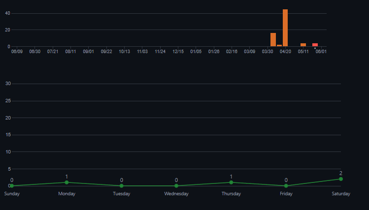
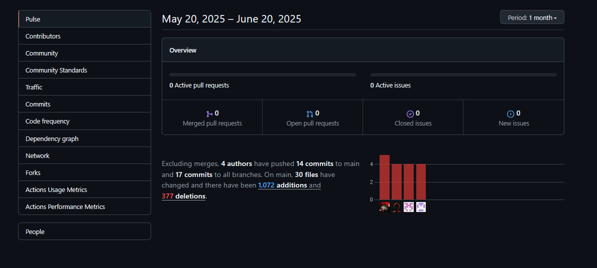

<h1 align="center"> UNIVERSIDAD PERUANA DE CIENCIAS APLICADAS </h1>

<h2 align="center"> INGENIERIA DE SOFTWARE</h2>
<h2 align="center"> CICLO 2025-1</h2>

<div align="center">
    
</div>

<br>
<h3 align="center"> Aplicaciones Web - WS51 </h3>
<h3 align="center"> Profesor del Curso: Hugo Allan Mori Paiva </h3>
<h3 align="center"> "INFORME DE TRABAJO FINAL"</h3>
<h3 align="center"> Nombre de Startup: QuantumSoft  </h3>
<h3 align="center"> Nombre del Producto: KidyCare  </h3>

<div align="center">

| Miembro                         |   Código   |
| :------------------------------ | :--------: |
| Meza Camayo, Lynn Jeeferzon     | U20201C320 |
| Fajardo Monrroy, Walter Luis    | U202221632 |
| Cuentas Peña, Joaquin Alberto   | U20201F788 |
| Linares Arroyo, Jorge Alexandro | U202318624 |
| Avila Palacios, Aarón Alexander | U201823654 |

</div>
<h3 align="center"> ABRIL - 2025   </h3>

## REGISTRO DE VERSIONES

| Versión | Fecha    | Autor       | Descripción de Modificación            |
| ------- | -------- | ----------- | -------------------------------------- |
| 0.1     | 03/04/25 | Lynn Meza   | Desarrollo de la Structura del informe |
| 0.1     | 20/04/25 | Aaron Avila | Registro y analisis de entrevista      |
|         |          |             |                                        |

## PROJECT REPORT COLLABORATION INSIGHTS

URL del repositorio del project Report : https://github.com/2025-1-AplicacionesWeb-QuantumSoft/project-report-childcard

**_TB1_**
Entregrable 1 o TB1 : (25/04/25)


## CONTENIDO

### Tabla de contenido

- [Capítulo I: Introducción](#capítulo-i-introducción)
  - [1.1. Startup Profile](#11-startup-profile)
    - [1.1.1. Descripción de la Startup](#111-descripción-de-la-startup)
    - [1.1.2. Perfiles de integrantes del equipo](#112-perfiles-de-integrantes-del-equipo)
  - [1.2. Solution Profile](#12-solution-profile)
    - [1.2.1 Antecedentes y problemática](#121-antecedentes-y-problemática)
    - [What (¿Qué?)](#what-qué)
    - [When (¿Cuándo?)](#when-cuándo)
    - [Where (¿Donde?)](#where-donde)
    - [Who (¿Quienes?)](#who-quienes)
    - [Why (¿Por qué?)](#why-por-qué)
    - [How (¿Cómo?)](#how-cómo)
    - [How much (¿Cuánto?)](#how-much-cuánto)
    - [1.2.2 Lean UX Process.](#122-lean-ux-process)
      - [1.2.2.1. Lean UX Problem Statements.](#1221-lean-ux-problem-statements)
      - [1.2.2.2. Lean UX Assumptions.](#1222-lean-ux-assumptions)
      - [1.2.2.3. Lean UX Hypothesis Statements.](#1223-lean-ux-hypothesis-statements)
      - [1.2.2.4. Lean UX Canvas.](#1224-lean-ux-canvas)
  - [1.3. Segmentos objetivo.](#13-segmentos-objetivo) - [**a)Padres/Tutores:**](#apadrestutores) - [Segmentación Geográfica:](#segmentación-geográfica) - [Segmentación Demográfica:](#segmentación-demográfica) - [Segmentación Psicográfica:](#segmentación-psicográfica) - [Segmentación Conductual:](#segmentación-conductual) - [**b) Niñeras/Cuidadores:**](#b-niñerascuidadores) - [Segmentación Geográfica:](#segmentación-geográfica-1) - [Segmentación Demográfica:](#segmentación-demográfica-1) - [Segmentación Psicográfica:](#segmentación-psicográfica-1) - [Segmentación Conductual:](#segmentación-conductual-1)
- [Capítulo II: Requirements Elicitation \& Analysis](#capítulo-ii-requirements-elicitation--analysis)
  - [2.1. Competidores.](#21-competidores)
    - [2.1.1. Análisis competitivo.](#211-análisis-competitivo)
- [Panorama de análisis competitivo](#panorama-de-análisis-competitivo)
  - [Análisis FODA](#análisis-foda)
    - [2.1.2. Estrategias y tácticas frente a competidores.](#212-estrategias-y-tácticas-frente-a-competidores)
  - [2.2. Entrevistas.](#22-entrevistas)
    - [2.2.1. Diseño de entrevistas.](#221-diseño-de-entrevistas)
    - [Preguntas para niñeras certificadas:](#preguntas-para-niñeras-certificadas)
    - [Preguntas para Para padres de familia](#preguntas-para-para-padres-de-familia)
    - [2.2.2. Registro de entrevistas.](#222-registro-de-entrevistas)
      - [Entrevista:](#entrevista)
      - [Entrevista:](#entrevista-1)
      - [Segmento 2:Padres de familia](#segmento-2padres-de-familia)
      - [Entrevista:](#entrevista-2)
      - [Entrevista:](#entrevista-3)
    - [2.2.3. Análisis de entrevistas.](#223-análisis-de-entrevistas)
  - [2.3. Needfinding.](#23-needfinding)
    - [2.3.1. User Personas.](#231-user-personas)
    - [2.3.2. User Task Matrix.](#232-user-task-matrix)
    - [2.3.3. User Journey Mapping.](#233-user-journey-mapping)
    - [2.3.4. Empathy Mapping.](#234-empathy-mapping)
    - [2.3.5. As-is Scenario Mapping.](#235-as-is-scenario-mapping)
  - [2.4. Ubiquitous Language.](#24-ubiquitous-language)
- [Capítulo III: Requirements Specification](#capítulo-iii-requirements-specification)
  - [3.1. To-Be Scenario Mapping.](#31-to-be-scenario-mapping)
  - [3.2. User Stories.](#32-user-stories)
  - [3.3. Impact Mapping.](#33-impact-mapping)
  - [3.4. Product Backlog.](#34-product-backlog)
- [Capítulo IV: Product Design](#capítulo-iv-product-design)
  - [4.1. Style Guidelines.](#41-style-guidelines)
    - [4.1.1. General Style Guidelines.](#411-general-style-guidelines)
    - [4.1.2. Web Style Guidelines](#412-web-style-guidelines)
  - [4.2. Information Architecture](#42-information-architecture)
  - [1. Página de Inicio](#1-página-de-inicio)
  - [2. Buscar Cuidadores (Para Padres y Tutores)](#2-buscar-cuidadores-para-padres-y-tutores)
  - [3. Registro de Cuidadores](#3-registro-de-cuidadores)
  - [4. Reservar Servicios de Cuidado](#4-reservar-servicios-de-cuidado)
    - [4.2.1. Organization Systems](#421-organization-systems)
    - [4.2.2. Labeling Systems](#422-labeling-systems)
    - [4.2.3. SEO Tags and Meta Tags](#423-seo-tags-and-meta-tags)
    - [4.2.4. Searching Systems](#424-searching-systems)
    - [4.2.5. Navigation Systems](#425-navigation-systems)
  - [4.3. Landing Page UI Design.](#43-landing-page-ui-design)
    - [4.3.1. Landing Page Wireframe.](#431-landing-page-wireframe)
    - [4.3.2. Landing Page Mock-up.](#432-landing-page-mock-up)
  - [4.4. Web Applications UX/UI Design.](#44-web-applications-uxui-design)
    - [4.4.1. Web Applications Wireframes.](#441-web-applications-wireframes)
    - [4.4.2. Web Applications Wireflow Diagrams.](#442-web-applications-wireflow-diagrams)
    - [4.4.2. Web Applications Mock-ups.](#442-web-applications-mock-ups)
    - [4.4.3. Web Applications User Flow Diagrams.](#443-web-applications-user-flow-diagrams)
  - [4.5. Web Applications Prototyping.](#45-web-applications-prototyping)
  - [4.6. Domain-Driven Software Architecture.](#46-domain-driven-software-architecture)
    - [4.6.1. Software Architecture Context Diagram.](#461-software-architecture-context-diagram)
    - [4.6.2. Software Architecture Container Diagrams.](#462-software-architecture-container-diagrams)
    - [4.6.3. Software Architecture Components Diagrams.](#463-software-architecture-components-diagrams)
  - [4.7. Software Object-Oriented Design.](#47-software-object-oriented-design)
    - [4.7.1. Class Diagrams.](#471-class-diagrams)
    - [4.7.2. Class Dictionary.](#472-class-dictionary)
  - [4.8. Database Design.](#48-database-design)
    - [4.8.1. Database Diagram.](#481-database-diagram)
- [Capítulo V: Product Implementation, Validation \& Deployment](#capítulo-v-product-implementation-validation--deployment)
  - [5.1. Software Configuration Management.](#51-software-configuration-management)
    - [5.1.1. Software Development Environment Configuration.](#511-software-development-environment-configuration)
    - [5.1.2. Source Code Management.](#512-source-code-management)
    - [5.1.3. Source Code Style Guide \& Conventions.](#513-source-code-style-guide--conventions)
    - [5.1.4. Software Deployment Configuration.](#514-software-deployment-configuration)
  - [5.2. Landing Page, Services \& Applications Implementation.](#52-landing-page-services--applications-implementation)
    - [5.2.1. Sprint 1](#521-sprint-1)
      - [5.2.1.1. Sprint Planning 1.](#5211-sprint-planning-1)
      - [5.2.1.2. Aspect Leaders and Collaborators.](#5212-aspect-leaders-and-collaborators)
      - [5.2.1.3. Sprint Backlog n.](#5213-sprint-backlog-n)
      - [5.2.1.4. Development Evidence for Sprint Review.](#5214-development-evidence-for-sprint-review)
      - [5.2.1.5. Execution Evidence for Sprint Review.](#5215-execution-evidence-for-sprint-review)
      - [5.2.1.6. Services Documentation Evidence for Sprint Review.](#5216-services-documentation-evidence-for-sprint-review)
      - [5.2.1.7. Software Deployment Evidence for Sprint Review.](#5217-software-deployment-evidence-for-sprint-review)
      - [5.2.1.8. Team Collaboration Insights during Sprint.](#5218-team-collaboration-insights-during-sprint)
      - [Colaboración y Desarrollo de Actividades](#colaboración-y-desarrollo-de-actividades)
    - [5.2.2. Sprint 2](#522-sprint-2)
      - [5.2.2.1. Sprint Planning 2](#5221-sprint-planning-2)
      - [5.2.2.2. Aspect Leaders and Collaborators](#5222-aspect-leaders-and-collaborators)
      - [5.2.2.3. Sprint Backlog 2](#5223-sprint-backlog-2)
      - [5.2.2.4. Development Evidence for Sprint Review](#5224-development-evidence-for-sprint-review)
      - [5.2.2.5. Execution Evidence for Sprint Review](#5225-execution-evidence-for-sprint-review)
      - [5.2.2.6. Services Documentation Evidence for Sprint Review](#5226-services-documentation-evidence-for-sprint-review)
      - [5.2.2.7. Software Deployment Evidence for Sprint Review](#5227-software-deployment-evidence-for-sprint-review)
      - [5.2.2.8. Team Collaboration Insights during Sprint](#5228-team-collaboration-insights-during-sprint)
  - [5.3. Validation Interviews.](#53-validation-interviews)
    - [5.3.1. Diseño de Entrevistas.](#531-diseño-de-entrevistas)
    - [5.3.2. Registro de Entrevistas.](#532-registro-de-entrevistas)
    - [5.3.3. Evaluaciones según heurísticas.](#533-evaluaciones-según-heurísticas)
  - [5.4. Video About-the-Product.](#54-video-about-the-product)
- [Conclusiones](#conclusiones)
  - [Conclusiones y recomendaciones.](#conclusiones-y-recomendaciones)
  - [Video About-the-Team.](#video-about-the-team)
  - [Bibliografía Anexos](#bibliografía-anexos)

### Tabla de imagenes

## STUDENT OUTCOME

<table>
    <tr>
        <th>CRITERIO ESPECIFICO</th>
        <th>ACCIONES REALIZADAS</th>
        <th>CONCLUSIONES</th>
    </tr>
    <tr>
        <th>Trabaja en equipo para proporcionar liderazgo en forma conjunta</th>
        <td>
          <b>Lynn Meza: TB1</b><br>
          Fomentó la colaboración y el crecimiento compartido al participar en el desarrollo de los to-be Scenario map, user sotires, impact map y Product backlog.<br>
          Ademas, desarrollo Software Configuration Management y todo los puntos del sprint 1 con el implementacion de la seccion de caracteristicas de la landing page.<br>
          <b>Lynn Meza: TB2</b><br>
          Deserralle el boounded context pay, que esta incluido endpoint de card y payment. Ademas, de la correcion del mismo bounded en el fronend.<br>
          <br>
          <b>Jorge Linares: TB1</b><br>
          Desempeñe en el trabajo en equipo con el desarrollo del Capítulo IV, desarrollo el estilo, arquitectura de información y diseño UX/UI de la aplicación. Cree los wireframes, mock-ups y prototipos de la aplicación y landing pages, así como en el diseño de la arquitectura de software y diagrama UML. Además, de realizar la sección del Hero y navbar de la landing page.<br>
          <br>
          <b>Joaquin Cuentas: TB1</b><br>
          Fomenté la investigación de nuestros usuarios y las ideas que nos diferenciarán de nuestros competidores.<br>
          Materialicé la información obtenida en diagramas del modelo Scrum que nos permitirán ofrecer a nuestros usuarios sus opiniones manidestadas. <br>
          <b>Joaquin Cuentas: TB2</b><br>
          Fomenté la participación de grupo instando reuniones para planificar el sprint 2, así como resolver dudas acerca de la implementación del backend. asímismo, materialicé mi esfuerzo planificando fechas para avanzar el backends.<br>
          <br>
          <b>Walter Fajardo: TB1</b><br>
          Fomentó el trabajo en equipo y el desarrollo del proyecto al realizar el desarrollo de los segmentos objetivos.<br>
          Tambien se desarrollaronlas 5W y 2H ademas de aportar a la seccion de contacto en la landing page.<br>
          <b>Walter Fajardo: TB2</b><br>
          Se realizo el backend del perfil de niñeras y se avanzo el documento de trabajo, además de actualizar el frontend<br>
        </td>
        <td>
          <b>TB1</b><br>
          En conclusión, a través de un liderazgo colaborativo, nuestro equipo logró desarrollar exitosamente la landing page del producto, integrando habilidades complementarias y tomando decisiones conjuntas en cada etapa. Desde el análisis inicial hasta la implementación final, la comunicación constante, la distribución equitativa de responsabilidades y la retroalimentación grupal nos permitieron alinear objetivos garantizando un producto centrado en el usuario. Este proyecto evidenció que el trabajo en equipo, con un liderazgo compartido y flexible, es fundamental para impulsar soluciones innovadoras y alcanzar resultados sólidos de manera eficiente.<br><br>
          <b>TB2:</b><br>
          En conclusión, el desarrollo del backend de nuestro proyecto se logró gracias a un liderazgo compartido y enfocado en la colaboración. Cada miembro del equipo asumió responsabilidades según sus habilidades, lo que facilitó una organización eficiente y una toma de decisiones conjunta. Definimos fechas de entrega y fomentamos una comunicación constante mediante el grupo de whatsapp. Esta forma de trabajo no solo reforzó nuestras capacidades técnicas, sino que también promovió el crecimiento del liderazgo tanto individual como grupal.
        </td>
    </tr>
    <tr>
        <th>Crea un entorno colaborativo e inclusivo, establece metas, planifica tareas y cumple objetivos</th>
        <td>
          <b>Lynn Meza: TB1</b><br>
          Desarrolle los to-be Scenario map, user sotires, impact map y Product backlog.<br>
          Ademas, desarrollo Software Configuration Management y todo los puntos del sprint 1 con el implementacion de la seccion de caracteristicas de la landing page.
          <b>Lynn Meza: TB1</b><br>
          Implemente el boounded context pay, que esta incluido endpoint de card y payment. Ademas, de la correcion del mismo bounded en el fronend.<br>
          <br>
          <b>Jorge Linares: TB1</b><br>
          Desempeñe en el trabajo colaborativo con el desarrollo del Capítulo IV, desarrollo el estilo, arquitectura de información y diseño UX/UI de la aplicación. Cree los wireframes, mock-ups y prototipos de la aplicación y landing pages, así como en el diseño de la arquitectura de software y diagrama UML. Además, de realizar la sección del Hero y navbar de la landing page.<br>
          <b>Jorge Linares: TB2</b><br>
          Desarrollo del bounded context Reservations, Revision de segunda version del frotend. Despliegue backend. Participacion del spring 3.<br>
          <br>
          <b>Joaquin Cuentas: TB1</b><br>
          Me planifiqué a completar el capítulo 2, caracterirzado por la investigación de competidores, la recolección de datos mediante entrevistas y los diagramas del modelo scrum. <br>
          Cumplí estos objetivos dentro del plazo establecido y obtuvimos un proyecto eficiente<br>
          <b>Joaquin Cuentas: TB2</b><br>
          Me planifiqué a implementar el PUT y POST del backend del bounded context Review, así como planificar las entrevistas para la evaluación de landing page y frontend para su posterior análisis. <br>
          <br>
          <b>Walter Fajardo: TB1</b><br>
          Realice los lean ux proccess, que constaron de los problem statements, assumptions, canvas y segmentos objetivo además de la implementacion de la seccion de consulta en la landing page
        </td>
        <b>Walter Fajardo: TB2</b><br>
          Se realizo el backend del perfil de niñeras y se avanzo el documento de trabajo, además de actualizar el frontend<br>
        <td>
          <b>TB1:</b><br>
          En conclucion, El desarrollo de nuestra app de tutores y cuidadores se reflejó un liderazgo colaborativo, donde el equipo trabajó de manera articulada en cada fase, desde el análisis de la problematica y los segmentos objetivos hasta la implementación ágil con sprints . La integración de metodologías Lean UX ayudo en el diseño centrado en el usuario, permitiendo entregar una solución viable y funcional. Este proyecto demostró que el trabajo en equipo, con roles definidos y comunicación constante, es clave para transformar ideas en productos digitales efectivos, superando desafíos técnicos y de usabilidad con un enfoque conjunto.<br><br>
          <b>TB2:</b><br>
          En conclusión, la implementación del backend se desarrolló dentro de un ambiente de trabajo inclusivo y seguro, en el que todos los integrantes del equipo pudieron participar libremente, compartir sus ideas y contribuir en cada etapa del proyecto. Promovimos el respeto, la equidad y la escucha activa, asegurándonos de que cada voz fuera tomada en cuenta, sin importar el rol o la experiencia previa.
        </td>
    </tr>
</table>


# Capítulo I: Introducción

## 1.1. Startup Profile

### 1.1.1. Descripción de la Startup

KYDICARE Es una innovadora plataforma tecnológica diseñada para transformar la manera en que los padres se encuentran y contratan niñeras, ofreciendo una experiencia completa que no solo simplifica, sino que también optimiza el proceso de selección y contratación. Esta aplicación está pensada para familias que buscan un enfoque personalizado y eficiente al momento de elegir a la persona encargada del cuidado de sus hijos. Con esta herramienta, los usuarios pueden buscar cuidadoras por ubicación, consultar su disponibilidad y agendar horarios de manera flexible, garantizando que siempre encontrarán la opción que mejor se adapta a sus necesidades.

Además, la plataforma permite a los padres calificar el servicio recibido, proporcionando retroalimentación valiosa que ayuda a las niñeras a mejorar continuamente y fortalecer su reputación dentro de la comunidad. Las cuidadoras, por su parte, pueden gestionar su perfil de manera intuitiva, mostrando su disponibilidad y recibiendo recomendaciones que les permiten destacarse en la plataforma. Gracias a su diseño accesible y funcionalidades pensadas para la comodidad de los usuarios, esta aplicación se posiciona como una aliada confiable para quienes buscan tranquilidad y confianza al momento de contratar servicios de cuidado infantil.

### 1.1.2. Perfiles de integrantes del equipo

| Foto                                                         | Nombre                              | Código     | Descripción                                                                                                                                                                                                                                                                                                                                                                                                                                                                                                                                                                                                                                                                                                     |
| ------------------------------------------------------------ | ----------------------------------- | ---------- | --------------------------------------------------------------------------------------------------------------------------------------------------------------------------------------------------------------------------------------------------------------------------------------------------------------------------------------------------------------------------------------------------------------------------------------------------------------------------------------------------------------------------------------------------------------------------------------------------------------------------------------------------------------------------------------------------------------- |
|               | **Avila Palacios, Aaron Alexander** | U201823654 | > Soy estudiante de Ingeniería de software y estoy cursando el quinto ciclo de la carrera. Tengo 23 años. Tengo conocimientos en programación orientada a objetos en lenguaje de programación C++, también en diseño de prototipos de aplicaciones, diseño gráfico, diseño e implementación de páginas web. Todas estas habilidades ayudan al desarrollo del proyecto, dado que son de vital importancia en este curso y en nuestra carrera. Soy capaz de desarrollar de manera eficaz cualquier tarea que se me asigne.                                                                                                                                                                                        |
|     | **Walter Luis Fajardo Monrroy**     | U202221632 | > Soy Walter Luis Fajardo Monrroy, cuento con 20 años y por motivos de estudio resido en Lima. Soy estudiante de la carrera de ingeniería de software, en mi formación como estudiante durante estos ciclos adquirí conocimientos en programación principalmente con lenguaje C++ y Python. También cuento con conocimientos en patrones de software al momento de realizar mis proyectos, además de experiencia realizando diagramas de clases y empleando el DDD (Diseño orientado a objetos). Las habilidades primarias para resaltar serían la responsabilidad y resiliencia frente a las adversidades. Cuento con experiencia en organización y trabajo grupal lo cual emplearé para beneficio del equipo. |
|   | **Joaquin Alberto Cuentas Peña**    | U20201F788 | > Soy estudiante de la UPC de la carrera de Ingeniería de Software y me encuentro cursando el 5to ciclo. Cuento con habilidades de programación en C++ y Python, así como aptitudes para el desarrollo en UX y UI. Asimismo, en cuanto a habilidades extracurriculares, he contribuido en proyectos con edición de video y fomentando una actitud colaborativa en equipo.                                                                                                                                                                                                                                                                                                                                       |
|  | **Jorge Alexandro Linares Arroyo**  | U202318624 | > Estudiante de la carrera de Ingeniería de Software, interesado por el mundo tecnológico y cuento con habilidades para formar parte de ello con conocimiento en desarrollo web. Me considero una persona muy perseverante que le gusta hacer las cosas detalladamente y con criterio.                                                                                                                                                                                                                                                                                                                                                                                                                          |
|          | **Lynn Jeeferzon Meza Camayo**      | U20201C320 | > Mi nombre es Lynn Jeeferzon Meza Camayo, tengo 21 años. Me considero un integrante activo, comprometido con el trabajo y con muchas ganas de aprender más de este proyecto y curso. Escogí esta carrera por mi interés en saber cómo se crean la juegos, aplicaciones y software. Me gusta la tecnología, leer novelas ligeras y jugar videojuegos de trabajo en equipo con amigos. Cuento con conocimiento en C++, HTML, Git, JavaScript, Java y SQL.                                                                                                                                                                                                                                                        |

## 1.2. Solution Profile

### 1.2.1 Antecedentes y problemática

Actualmente, debido a los ritmos acelerados de vida y las múltiples responsabilidades que enfrentan las familias modernas, encontrar una niñera de confianza se ha convertido en un desafío constante. La falta de tiempo para realizar búsquedas exhaustivas, la incertidumbre sobre la disponibilidad de las cuidadoras y la dificultad para verificar referencias confiables generan preocupación en los padres que buscan garantizar el bienestar de sus hijos. Además, la oferta de servicios de cuidado infantil muchas veces se encuentra dispersa y poco organizada, lo que dificulta aún más el proceso de selección. Esta situación, sumada a la creciente necesidad de conciliar la vida laboral y familiar, resalta la importancia de contar con soluciones prácticas y seguras que faciliten la conexión entre padres y niñeras capacitadas

Nuestro objetivo es comprender las necesidades de nuestros usuarios, por lo tanto, hemos analizamos sus historiales y la problemática bajo el enfoque de las 5 ‘W’s y 2 ‘H’s.

### What (¿Qué?)

¿Cuál es el problema abordado?
La aplicación KYDICARE aborda el problema que enfrentan muchos padres al buscar niñeras confiables y disponibles que se adapten a sus necesidades específicas, tanto en términos de ubicación como de horario.
¿Cuál es la relación con la persona en cuestión?
Los padres que a menudo tienen dificultades para encontrar rápidamente una persona de confianza que cuide de sus hijos y también las niñeras ya que podrán hacer uso de la aplicación para ofrecer sus servicios.

### When (¿Cuándo?)

¿Cuándo sucede el problema?
El problema ocurre en la vida diaria, especialmente cuando los padres necesitan equilibrar sus responsabilidades laborales, personales o sociales y requieren apoyo confiable para el cuidado infantil
¿Cuándo utiliza el cliente el producto?
Los usuarios utilizan la aplicación cuando necesitan buscar, contactar o agendar una niña, ya sea en situaciones de urgencia o con antelación. La flexibilidad de la aplicación permite que sea útil en cualquier momento que surja esta necesidad.

### Where (¿Donde?)

¿Dónde está el usuario cuando usa el producto?
Generalmente, el usuario se encuentra en su hogar, en el trabajo o en movimiento cuando utiliza la aplicación, dado que se trata de una plataforma digital accesible desde cualquier dispositivo con conexión a internet.
¿Dónde surge el problema?
El problema surge en cualquier contexto donde los padres requieran asistencia para el cuidado de sus hijos y no cuenten con un apoyo inmediato o un acceso fácil a servicios confiables de niñeras.

### Who (¿Quienes?)

¿Quiénes están involucrados?
KYDICARE está diseñado para servir a dos principales grupos:

- Padres y tutores que requieren un cuidador disponible y de confianza
- Niñeras que cumplen los requisitos solicitados y desean prestar sus servicios.
  ¿Quién lo utilizará?
  El producto será utilizado principalmente por padres y tutores en busca de cuidado infantil, así como por niñeras que desean ofrecer sus servicios y gestionar su disponibilidad.

### Why (¿Por qué?)

¿Cuál es la causa del problema?
La creciente carga laboral y las agendas ocupadas, sumadas a la dificultad para encontrar servicios confiables de cuidado infantil de forma rápida y sencilla, hacen que muchas familias se enfrenten a complicaciones al buscar apoyo para el cuidado de sus hijos.

### How (¿Cómo?)

¿En qué condiciones los clientes usan nuestro producto?
Nuestros usuarios pueden usar el producto cumpliendo la única condición de contar con un aparato tecnológico mediante el cual puedan acceder al aplicativo y emplear las opciones que ofrecemos.
¿Cómo nos conocieron los compradores?
Nuestros clientes pueden conocer nuestro producto por recomendaciones de conocidos o publicidad en línea.
¿Cómo prefieren los lectores acceder a nuestro contenido?
Nuestros usuarios prefieren una plataforma que ofrezca información clara, segura y verificada, la cual permita comparar opciones de niñeras, revisar calificaciones de otros usuarios y contar con un proceso sencillo de contacto y contratación.
¿Qué llevó a la persona a llegar a esta situación?
Las personas pudieron verse afectadas por factores como la falta de tiempo, la ausencia de contactos de confianza para el cuidado infantil, o la necesidad de contar con alternativas confiables y flexibles, entre otras molestias llevaron a los usuarios a buscar una solución óptima como esta aplicación.

### How much (¿Cuánto?)

El efecto económico es considerable. Numerosas familias no pueden afrontar los altos costos del cuidado infantil, lo que frecuentemente las lleva a tomar decisiones que podrían afectar negativamente el bienestar de sus hijos. La falta de cuidadores calificados también contribuye al aumento de los precios, lo que dificulta aún más el acceso a un cuidado infantil de calidad, perpetuando así las desigualdades sociales y económicas. Sumado a ello existe una fuerte desconfianza de los padres respecto a confiar a sus hijos a otras personas al no contar con referencias.

### 1.2.2 Lean UX Process.

#### 1.2.2.1. Lean UX Problem Statements.

Nuestra plataforma KYDICARE tiene como propósito enfrentar un desafío importante en el ámbito del cuidado infantil: la dificultad de conectar a padres con cuidadores confiables. Muchos padres encuentran complicado acceder a opciones de cuidado y educación infantil de calidad en el hogar, lo que genera estrés y dificulta el equilibrio entre el trabajo y la vida familiar. Por otro lado, cuidadores y educadores también enfrentan obstáculos para encontrar familias que requieran sus servicios, lo que reduce sus oportunidades laborales y limita el acceso de las familias a servicios adecuados.

Nos planteamos la siguiente pregunta: ¿cómo podemos cerrar la brecha entre padres que buscan un cuidado infantil confiable y cuidadores que desean trabajar? Entendiendo las dificultades que enfrentan ambas partes, proponemos una solución que permita superar esas barreras a través de una plataforma que promueva conexiones efectivas y aumente tanto la disponibilidad como la calidad del cuidado infantil, generando beneficios mutuos para padres y cuidadores.

#### 1.2.2.2. Lean UX Assumptions.

**Business Assumptions**

- Se espera que los padres estén abiertos a utilizar una solución digital para encontrar cuidadores confiables, especialmente si esta ofrece perfiles verificados y opciones personalizadas que se ajusten a sus necesidades de cuidado infantil.

- La necesidad de servicios de alta calidad en el cuidado infantil está en aumento, impulsada por una mayor preocupación por la seguridad y el desarrollo de los niños en entornos domésticos.

- Los cuidadores verán con buenos ojos una plataforma que les permita conectarse fácilmente con familias que requieren sus servicios, sobre todo si esta mejora su visibilidad profesional y les brinda mayores oportunidades laborales.

- Contamos con la capacidad técnica y los recursos necesarios para desarrollar y mantener la plataforma **KYDICARE**, garantizando su correcto funcionamiento y posibilidad de escalar a medida que crece la demanda.

- La facilidad de uso y el acceso intuitivo serán elementos esenciales para el éxito de la plataforma, permitiendo que tanto padres como cuidadores la utilicen sin dificultad, independientemente de su experiencia tecnológica.

- El mercado del cuidado infantil está en expansión y representa una oportunidad significativa para que **KYDICARE** se establezca como una solución comercial viable.

- La protección y confidencialidad de los datos personales serán aspectos centrales, y se confía en que los usuarios valorarán la seguridad con la que se gestionará su información.

- La plataforma tendrá la capacidad de ajustarse a diversas necesidades educativas y de cuidado infantil, lo que atraerá a una amplia gama de usuarios en busca de servicios confiables, flexibles y de calidad.

**User Assumptions**

¿Quiénes son nuestros usuarios?

- Nos dirigimos principalmente a padres que necesitan encontrar cuidadores confiables para el cuidado infantil en el hogar, así como a los cuidadores que desean ofrecer sus servicios a estas familias.

¿Cómo se integra nuestro producto en su vida cotidiana?

- **KYDICARE** forma parte del día a día de los padres al facilitar la búsqueda y gestión del cuidado infantil, y también se convierte en una herramienta clave para los cuidadores en la búsqueda de oportunidades laborales.

¿Qué desafíos enfrenta el producto y cómo pueden solucionarse?

- Entre los retos de KYDICARE se encuentran garantizar la calidad y confianza en los cuidadores y educadores, incorporar funciones que permitan actualizaciones en tiempo real sobre las actividades de los niños, y mantener a los usuarios activos a través de recursos útiles. Para superarlos, se proponen mecanismos de verificación robustos, herramientas de comunicación y seguimiento en tiempo real, así como contenido educativo valioso para todos los usuarios.

¿Cuándo y de qué manera se utiliza la plataforma?

- KYDICARE se utiliza cuando los padres necesitan contratar o gestionar servicios de cuidado infantil, y cuando los cuidadores están en búsqueda de empleo y desean conectarse con familias. La plataforma permite realizar reservas, comunicarse directamente y hacer seguimiento de las actividades relacionadas con el cuidado.

¿Qué funcionalidades son esenciales?

- Algunas características clave incluyen: perfiles verificados de cuidadores, opciones de personalización según las necesidades de cada familia, notificaciones en tiempo real sobre las actividades de los niños y acceso a materiales educativos relevantes.

¿Cómo debe lucir y comportarse la plataforma?

- La interfaz de KYDICARE debe ser clara, amigable y sencilla de usar, permitiendo una navegación fluida para reservar servicios, establecer comunicación entre padres y cuidadores y acceder a recursos útiles. Debe transmitir confianza, seguridad y facilidad de uso para todos los niveles de experiencia tecnológica.

#### 1.2.2.3. Lean UX Hypothesis Statements.

<ol> <li><b>Creemos que</b> los padres valorarán poder encontrar y elegir cuidadores verificados según sus necesidades específicas. <b>Sabremos que</b> esto es cierto <b>cuando</b> detectemos una alta retención de usuarios y un aumento constante en las reservas dentro de la plataforma.</li> <li><b>Creemos que</b> los cuidadores apreciarán lo intuitiva que es la plataforma para conectarse con familias que requieren sus servicios. <b>Sabremos que</b> esto es cierto <b>cuando</b> observemos un crecimiento en la cantidad de cuidadores activos y registrados, junto con una elevada interacción con los perfiles familiares.</li> <li><b>Creemos que</b> establecer un proceso exhaustivo de verificación para cuidadores y educadores incrementará la confianza de los padres en la plataforma. <b>Sabremos que</b> esto es cierto <b>cuando</b> veamos una reducción en las dudas relacionadas con la seguridad y un incremento en usuarios que finalizan su registro y confirman sus reservas.</li> <li><b>Creemos que</b> incluir actualizaciones en tiempo real sobre las actividades de los niños influirá positivamente en la decisión de los padres de usar la plataforma. <b>Sabremos que</b> esto es cierto <b>cuando</b> identifiquemos un uso frecuente de esta función y comentarios positivos por parte de los padres en sus evaluaciones.</li> <li><b>Creemos que</b> brindar recursos educativos y herramientas para seguir el desarrollo infantil ayudará a retener tanto a padres como a cuidadores. <b>Sabremos que</b> esto es cierto <b>cuando</b> observemos un uso sostenido de estas funcionalidades y una mayor lealtad de los usuarios con el tiempo.</li> </ol>

#### 1.2.2.4. Lean UX Canvas.

<table>
  <tr>
    <th valign="top">
      <p><b>1. Business Problem</b></p>
      <p>En Perú, la demanda por servicios de cuidado infantil está creciendo, pero el acceso a cuidadores confiables y calificados sigue siendo limitado. Esto genera dificultades tanto para las familias, que enfrentan estrés por la falta de opciones seguras, como para los cuidadores, que encuentran obstáculos para acceder a oportunidades laborales estables. La carencia de una herramienta eficiente que los conecte intensifica esta problemática.</p>
    </th>
    <th valign="top">
      <p><b>2. Business Outcomes</b></p>
      <p>- Mayor retención de usuarios, tanto padres como cuidadores.</p>
      <p>- Crecimiento en el número de reservas repetidas.</p>
      <p>- Niveles más altos de satisfacción entre los usuarios.</p>
      <p>- Ampliación de la comunidad de usuarios en la plataforma.</p>
    </th>
    <th rowspan="2" valign="top">
      <p><b>5. Solutions</b></p>
      <p>- Crear una plataforma que facilite el contacto entre padres y cuidadores verificados.</p>
      <p>- Incluir funciones como programación de servicios, notificaciones en tiempo real, materiales educativos y seguimiento del desarrollo infantil.</p>
    </th>
  </tr>
  <tr>
    <td valign="top">
      <p><b>3. Users</b></p>
      <p>- Usuarios principales: Padres que requieren apoyo en el cuidado y educación de sus hijos en casa.</p>
      <p>- Usuarios secundarios: Niñeras, tutores y educadores que buscan conectar con familias.</p>
      <p>- Clientes: Familias que contratan servicios, y cuidadores que pagan por visibilidad o acceso a más oportunidades.</p>
    </td>
    <td valign="top">
      <p><b>4. User Benefits</b></p>
      <p>- Para padres: Posibilidad de acceder a cuidadores y educadores verificados, agendar servicios a medida, y recibir información en tiempo real sobre sus hijos.</p>
      <p>- Para cuidadores: Acceso directo a empleos y una plataforma que valida y destaca sus habilidades y experiencia.</p>
    </td>
  </tr>
  <tr>
    <td valign="top">
      <p><b>6. Hypothesis</b></p>
      <p>- Creemos que los padres valorarán poder buscar y elegir cuidadores verificados. Sabremos que esto es cierto al ver una alta retención de usuarios y un aumento en las reservas realizadas.</p>
      <p>- Creemos que los cuidadores apreciarán la facilidad para conectarse con familias. Sabremos que esto es cierto al observar más cuidadores activos y registrados, y mayor interacción con perfiles de familias.</p>
      <p>- Creemos que un sistema de verificación sólido fortalecerá la confianza de los padres. Sabremos que esto es cierto si disminuyen las dudas sobre seguridad y aumentan los registros completos y las reservas confirmadas.</p>
      <p>- Creemos que las actualizaciones en tiempo real serán clave para los padres. Sabremos que esto es cierto si la función se usa con frecuencia y los padres expresan mayor satisfacción.</p>
      <p>- Creemos que proveer recursos educativos y herramientas de monitoreo del desarrollo infantil ayudará a mantener a los usuarios activos. Sabremos que esto es cierto si se da un uso continuo y mayor lealtad con el tiempo.</p>
    </td>
    <td valign="top">
      <p><b>7. What’s the most important thing we need to learn first?</b></p>
      <p>Es crucial confirmar si los usuarios valoran aspectos como seguridad, personalización y calidad del servicio que ofrece la plataforma.</p>
    </td>
    <td valign="top">
      <p><b>8. What’s the least amount of work we need to do to learn the next most important thing?</b></p>
      <p>Lanzaremos una versión beta que incluya las funciones principales y evaluaremos la respuesta y comentarios de los usuarios para validar la propuesta de valor.</p>
    </td>
  </tr>
</table>

## 1.3. Segmentos objetivo.

##### **a)Padres/Tutores:**

Son personas responsables del cuidado de niños que, debido a sus compromisos laborales, personales o imprevistos, requieren de apoyo confiable para garantizar la seguridad y bienestar de sus hijos. Para ellos, ofrecemos una plataforma que facilita la búsqueda y selección de niñeras calificadas, permitiéndoles consultar perfiles verificados, evaluar reseñas de otros usuarios y gestionar contrataciones de manera rápida y segura. La aplicación les brinda tranquilidad al saber que cuentan con acceso a cuidadores confiables que se adaptan a sus horarios y necesidades específicas.

###### Segmentación Geográfica:

- **Región:** Zonas urbanas y suburbanas donde los padres tienen una vida laboral activa y requieren apoyo frecuente con el cuidado infantil.
- **Distribución:** Ciudades medianas y grandes con alta concentración de familias nucleares y profesionales jóvenes, especialmente en zonas con alta densidad de oficinas, centros educativos y servicios.

###### Segmentación Demográfica:

- **Edad:** Padres, madres o tutores entre 25 y 45 años.
- **Nivel Socioeconómico:** Clase media y media-alta, con ingresos estables que les permiten invertir en servicios confiables de cuidado infantil..
- **Ocupación:** Profesionales en activo, emprendedores, trabajadores remotos o híbridos, madres y padres solteros que requieren apoyo adicional.

###### Segmentación Psicográfica:

- **Estilo de Vida:** Familias modernas con un estilo de vida dinámico, que valoran el equilibrio entre vida laboral y personal, y que buscan soluciones digitales prácticas.
- **Valores y creencias:** Priorizan la seguridad, la confianza y el bienestar de sus hijos. Valoran la eficiencia, la calidad del servicio y la reputación de las personas a las que confían el cuidado infantil.

###### Segmentación Conductual:

- **Beneficios Buscados:** Facilidad en el proceso de encontrar niñeras confiables, flexibilidad en la gestión de horarios, transparencia mediante valoraciones y recomendaciones y comunicación directa y fluida con las niñeras.
- **Uso del Producto:** Uso frecuente, especialmente en días laborales, eventos, o emergencias. También para contrataciones regulares a medio o largo plazo, como apoyo diario o semanal en el hogar

##### **b) Niñeras/Cuidadores:**

Son profesionales o personas con experiencia en el cuidado infantil que desean conectarse con familias que requieran de sus servicios. Para ellos, nuestra plataforma ofrece la oportunidad de ampliar sus oportunidades laborales, permitiéndoles crear perfiles detallados que destacan sus habilidades, certificaciones y disponibilidad. A través de la aplicación, las niñeras pueden gestionar sus agendas, recibir valoraciones que fortalezcan su reputación y establecer comunicación directa con los padres o tutores interesados ​​en contratarlas, facilitando un proceso transparente y eficiente para ambas partes.

###### Segmentación Geográfica:

- **Región:** Zonas urbanas y suburbanas con alta densidad de familias y oportunidades laborales en el sector de servicios.
- **Distribución:** Ciudades medianas y grandes donde existe una demanda constante de cuidado infantil, especialmente en áreas residenciales cercanas a centros educativos, zonas de oficinas y comunidades familiares.

###### Segmentación Demográfica:

- **Edad: Mujeres y hombres entre 20 y 45 años.**
- **Nivel Socioeconómico: Clase media o media-baja, con interés en generar ingresos flexibles o complementarios.**
- **Ocupación:** Estudiantes, jóvenes profesionales del área educativa o de la salud, personas con experiencia previa en el cuidado infantil, madres/padres que desean trabajar cuidando a otros niños, o personas en búsqueda de empleos temporales o medio tiempo.

###### Segmentación Psicográfica:

- **Estilo de Vida:** Personas activas que buscan flexibilidad laboral, ingresos adicionales o estabilidad en el empleo. Tienden a valorar el trabajo significativo, especialmente aquel relacionado con el cuidado y la formación de los niños.
- **Valores y creencias:** Valoran el compromiso, la empatía y la responsabilidad. Buscan entornos laborales donde sean valoradas, respetadas y puedan establecer relaciones de confianza con las familias.

###### Segmentación Conductual:

- **Beneficios Buscados:** Acceso a oportunidades laborales confiables y bien remuneradas, facilidad para gestionar su disponibilidad, visibilidad mediante valoraciones positivas, seguridad en las contrataciones y claridad en las condiciones laborales.
- **Uso del Producto:** Uso constante para encontrar nuevas oportunidades, mantener comunicación con familias, actualizar su perfil y gestionar horarios. También como herramienta para crear una reputación profesional y acceder a contrataciones a largo plazo.

# Capítulo II: Requirements Elicitation & Analysis

## 2.1. Competidores.

### 2.1.1. Análisis competitivo.

A continuación, se presentan algunos de los principales competidores identificados para nuestro proyecto. En esta sección tendremos una breve vista para conocer a nuestros competidores.

# Panorama de análisis competitivo

**¿Por qué llevar a cabo este análisis?**  
Este análisis es clave para entender el mercado, las necesidades de los usuarios y cómo Keychild puede ofrecer soluciones innovadoras y efectivas para poder destacarse frente a otras empresas y mejorar el producto.

| Características              | KYDICARE                                                                                                                            | Babysits                                                                | Nanny’s App                                                          |
| ---------------------------- | ----------------------------------------------------------------------------------------------------------------------------------- | ----------------------------------------------------------------------- | -------------------------------------------------------------------- |
| **Perfil - Overview**        | Plataforma que conecta familias con niñeras locales verificadas, usando preferencias personalizadas.                                | Plataforma global para conectar padres con niñeras y cuidadores.        | App para contratar niñeras verificadas de forma rápida y sencilla.   |
| **Ventaja competitiva**      | Perfiles certificados y verificados localmente, opción de entrevistas por videollamada integradas.                                  | Red internacional, gran cantidad de perfiles y calificaciones.          | Contratación inmediata en pocos clics, ideal para eventos puntuales. |
| **Mercado objetivo**         | Familias que buscan confianza, personalización y seguridad. Niñeras que buscan publicitar su servicios.                             | Padres que buscan cuidadoras locales o internacionales confiables.      | Padres con necesidades inmediatas de cuidado infantil.               |
| **Estrategias de marketing** | Campañas con influencers en parenting, marketing de contenidos en blogs de crianza, SEO local.                                      | SEO, presencia en redes sociales, campañas digitales y alianzas locales | Publicidad directa, visibilidad en tiendas de apps y eventos.        |
| **Precios & Costos**         | Freemium: uso básico gratuito, planes premium y soporte prioritario.                                                                | Planes desde gratis hasta membresías premium.                           | Costos por servicio, modelo tipo pay-per-use.                        |
| **Productos & Servicios**    | Perfiles con verificación documental, entrevistas por videollamada, chat seguro, alertas por geolocalización y reviews verificadas. | Conexión con niñeras, sistema de calificación, perfiles verificados.    | Contratación exprés, perfiles verificados, valoraciones de familias. |
| **Canales de distribución**  | App móvil (iOS y Android), plataforma web.                                                                                          | App móvil (iOS y Android), plataforma web.                              | App móvil (iOS y Android).                                           |

## Análisis FODA

| Elemento          | KYDICARE                                                       | Babysits                                                           | Nanny’s App                                                         |
| ----------------- | -------------------------------------------------------------- | ------------------------------------------------------------------ | ------------------------------------------------------------------- |
| **Fortalezas**    | Comunidad amplia y confiabilidad gracias al sistema de reseñas | Comunidad amplia y sistema de reseñas.                             | Cuenta con perfiles verificados.                                    |
| **Oportunidades** | Expandirse a más países, integrar videollamadas                | Expandirse a más países, integrar videollamadas o IA para matching | Ampliar su base de datos y servicios complementarios.               |
| **Debilidades**   | Posible saturación de perfiles, alta competencia               | Posible saturación de perfiles, alta competencia                   | Limitado para casos de uso esporádico; menos enfoque en largo plazo |
| **Amenazas**      | Posible dificultad en encontrar alcance de clientes            | Aparición de nuevas plataformas con tecnología más avanzada.       | Competencia fuerte y modelos de suscripción más completos           |

### 2.1.2. Estrategias y tácticas frente a competidores.

Estas son las principales estrategias que aplicará KYDICARE para diferenciarse de sus competidores:

- Ofrecer recomendaciones personalizadas y alertas automáticas de disponibilidad según el historial del usuario.
- Crear una campaña de marketing emocional enfocada en la seguridad infantil y testimonios reales de familias.

- Incluir un sello de verificación visible en los perfiles y reportes de antecedentes más detallados.

- Alianzas con instituciones certificadoras o gobiernos locales para reforzar el sistema de validación.

De esta manera nos diferenciaremos ofreciendo una experiencia más personalizada que otras apps del rubro y siendo la más segura del mercado.

## 2.2. Entrevistas.

### 2.2.1. Diseño de entrevistas.

### Preguntas para niñeras certificadas:

1. ¿Qué medios usas actualmente para encontrar trabajo como niñera?

2. ¿Qué tan fácil o difícil te resulta encontrar nuevas familias que necesiten tus servicios?

3. ¿Qué es lo más importante para ti al momento de elegir trabajar con una familia nueva?

4. ¿Qué información te gustaría mostrar en tu perfil si te publicitaras en una aplicación?

5. ¿Te sentirías cómoda siendo evaluada o recibiendo comentarios públicos de las familias? ¿Por qué?

6. ¿Qué características o herramientas crees que debería tener una app para ayudarte a encontrar más trabajo como niñera?

7. ¿Has usado alguna aplicación o plataforma similar antes? ¿Cuál fue tu experiencia?

8. ¿Qué te haría confiar en una aplicación nueva para ofrecer tus servicios?

9. ¿Cómo prefieres que te contacten las familias: por mensaje, llamada, a través de la app...?

10. ¿Estarías dispuesta a pagar una pequeña comisión o suscripción si la app te ayudara a conseguir trabajo más fácilmente? ¿Por qué sí o por qué no?

### Preguntas para Para padres de familia

1. ¿Cómo sueles encontrar niñeras cuando las necesitas?

2. ¿Qué dificultades has tenido al buscar una niñera de confianza para tus hijos?

3. ¿Qué características buscas en una niñera ideal?

4. ¿Qué información te gustaría ver en el perfil de una niñera dentro de una aplicación?

5. ¿Qué tan importante es para ti que la plataforma verifique a las niñeras antes de que aparezcan en la app? ¿Qué tipo de verificación esperas?

6. ¿Qué tipo de servicios te gustaría encontrar en una niñera desde una app?

7. ¿Qué nivel de interacción te gustaría tener con la niñera antes de contratarla?

8. ¿Te sentirías cómodo(a) evaluando públicamente a la niñera después de un servicio? ¿Por qué sí o no?

9. ¿Cuánto estarías dispuesto(a) a pagar por un servicio confiable y seguro para encontrar niñeras?

10 .¿Qué te haría confiar en una nueva aplicación para contratar niñeras?

### 2.2.2. Registro de entrevistas.


- Entrevista N°1: Andrea Santur
- Sexo: Niñera
- Edad: 23 años

- Ubicación en Los olivos, Lima, Perú

#### Entrevista:

link: https://youtu.be/XEUXEqPSi4k

**Resumen**
Andrea, de 23 años, ha trabajado como niñera en varios hogares y encuentra trabajo principalmente por redes sociales y recomendaciones. Considera importante que las familias sean claras con sus necesidades y respeten los horarios acordados. Si usara una app, compartiría su foto, referencias, turnos y servicios específicos. Se siente cómoda recibiendo calificaciones públicas, ya que ayudan a mejorar su visibilidad y desempeño. Además, le gustaría que la app incluya comentarios, calificaciones, estadísticas y opciones de contacto.


- Entrevista N°2: Alessandra Becerra
- Sexo: Femenino
- Edad: 20 años

- Ubicación no especificada para esta entrevista

#### Entrevista:

link: https://youtu.be/pCsz0xk5Z2k

**Resumen:**
Alessandra, una niñera de 20 años, comparte que encuentra trabajo principalmente a través de Facebook, recomendaciones y WhatsApp. Valora la confianza, el respeto y el buen trato con las familias. Le gustaría mostrar en su perfil experiencia, disponibilidad, referencias y formación. Apoya la idea de recibir comentarios respetuosos que ayuden a generar confianza. Considera útil que una app tenga filtrado por zona, calendario, chat y verificación de perfiles, aunque no ha tenido buena experiencia con apps similares. Confiaría en una nueva si se verificara a los padres.

#### Segmento 2:Padres de familia


- Entrevista N°3: Edery Abanto
- Sexo: Masculino
- Edad: 30 años

- Ubicación no especificada para esta entrevista

#### Entrevista:

link: https://youtu.be/k-bONuGLquw

**Resumen:**
Edery, un padre de familia comparte sus expectativas sobre una aplicación para contratar niñeras. Él busca principalmente seguridad, verificación de identidad y antecedentes, referencias reales, y disponibilidad clara. Prefiere tener una interacción previa con la niñera a través de chat o videollamada, y estaría dispuesto a pagar entre 20 y 50 soles por hora según el servicio. También valora una interfaz fácil de usar, reseñas de otros padres y la posibilidad de hacer evaluaciones públicas. Sus respuestas ofrecen una guía directa para diseñar una plataforma confiable, útil y centrada en las necesidades reales de los usuarios.


- Entrevista N°4: Eric Olivera
- Sexo: Masculino
- Edad: 27 años

- Ubicación en San Miguel, Lima, Perú

#### Entrevista:

link: https://youtu.be/5tE2mM7XAik

**Resumen**
Eric, de 27 años, es padre de dos hijos y suele buscar niñeras a través de recomendaciones personales. Aunque ha probado grupos en redes sociales, no le inspiran confianza. Encuentra difícil conseguir niñeras disponibles y confiables. Busca personas con experiencia, responsabilidad, puntualidad y manejo de emergencias. En una app, le gustaría ver perfiles con fotos, referencias, videos de presentación, formación y disponibilidad. Considera esencial que la plataforma verifique identidad. Está dispuesto a pagar entre 100 y 200 soles, o suscribirse mensualmente, si se le garantiza seguridad y buenas opciones

### 2.2.3. Análisis de entrevistas.

**Segmento 1: Niñeras con experiencia**
**Entrevista 1: Andrea Santur**
**Análisis de la entrevista:** La entrevista con Andrea, una joven niñera de 23 años con experiencia previa, valora que las familias sean claras en sus requerimientos y respetuosas con los horarios y límites. Al presentarse en una app, desea mostrar su rostro, disponibilidad, referencias y experiencia. Está completamente abierta a recibir calificaciones públicas y espera funciones como valoraciones, estadísticas de desempeño, chats en vivo y la posibilidad de ofrecer servicios premium. Para acceder a suscribirse, consideraría clave la facilidad de uso, buena reputación y funcionalidades específicas que le ayuden a visibilizarse

**Entrevista 2: Alessandra Becerra**
**Análisis de la entrevista:** La entrevista con Alessandra, permite comprender las necesidades, preferencias y limitaciones de las niñeras en la búsqueda de empleo. Ella destaca la importancia de la confianza mutua con las familias, la visibilidad de su experiencia, referencias y formación, así como el uso frecuente de canales de comunicación como redes sociales y WhatsApp. Identifica limitaciones como la inestabilidad en la demanda y la baja efectividad de las plataformas existentes. Finalmente, expresa disposición para ser evaluada y pagar por una aplicación útil

**Segmento 2: Padres de familia**

**Entrevista 1: Edery Abanto**
**Análisis de la entrevista:** El entrevistado, un padre de familia, revela su preocupación fundamental por la seguridad, la verificación de antecedentes, y la transparencia en los perfiles de las niñeras. Además, menciona su preferencia por plataformas con interacción previa, variedad de servicios y buena experiencia de usuario. La entrevista refleja una necesidad de soluciones tecnológicas confiables en el ámbito del cuidado de niños pequeños, destacando puntos clave para el desarrollo de nuestra aplicación.

**Entrevista 2: Eric Olivera**
**Análisis de la entrevista:** La entrevista con Eric, revela preocupaciones comunes en los padres al buscar servicios de niñera: confianza, seguridad y facilidad de uso. Prefiere recomendaciones cercanas, pero reconoce que eso limita las opciones. Su principal barrera al usar plataformas digitales es la falta de verificación confiable. Eric busca una niñera responsable, puntual, con experiencia y capacidad para manejar emergencias. Valora perfiles detallados, con fotos, videos, referencias y disponibilidad clara. Además, espera poder interactuar con las candidatas antes de contratarlas.

## 2.3. Needfinding.

### 2.3.1. User Personas.

Los User personas se realizaron en base a las distintas personas que entrevistamos según nuestros segmentos objetivos.
**Niñera con experiencia:**

**Psicólogo certificado:**


### 2.3.2. User Task Matrix.

En esta sección vamos a detallar las tareas que realizan los diferentes segmentos de usuarios representados por los User Personas de Keychild.
**Niñera con experiencia: María Fernanda**
| Actividades | María Fernanda | Frecuencia | Importancia |
|-------------------------------------|------------------|----------------|-------------|
| Describir su experiencia con familias previas | | Frecuentemente | Alta |
| Seleccionar su ubicación en el mapa | | Ocasionalmente | Media |
| Ver familias en búsqueda de niñera | | Frecuentemente | Alta |
| Ver reseñas de familias | | Ocasionalmente | Media |
| Acceder a entrevistas virtuales | | Frecuentemente | Media |

**Padre de familia: Alejandro Dominguez**
| Actividades | Alejandro Dominguez | Frecuencia | Importancia |
|-------------------------------------|----------------------|----------------|-------------|
| Buscar niñeras | | Frecuentemente | Alta |
| Filtrar niñeras por proximidad | | Frecuentemente | Alta |
| Filtrar niñeras por experiencia | | Ocasionalmente | Media |
| Agregar descripción familiar | | Ocasionalmente | Media |
| Agregar ubicación | | Frecuentemente | Media |

### 2.3.3. User Journey Mapping.

**USER PERSONA: María Fernanda**

El viaje de Mafer, una profesional en busca de oportunidades como niñera, es distinto al de Luis en forma pero igual de cargado emocionalmente. Comienza desde una posición de baja visibilidad, con esperanza y aceptación, deseando acceder a oportunidades reales, lo que representa una oportunidad clave para que las plataformas generen confianza inicial a través de rankings, reputación o contenido educativo. En la búsqueda activa de vacantes, la ansiedad se intensifica, haciendo fundamental la transparencia y el seguimiento del estado de las postulaciones. Al ser contactada por padres, Mafer siente entusiasmo y deseo de ser tratada con respeto, por lo que una guía compartida para entrevistas puede mejorar la experiencia para ambas partes. En la etapa de evaluación de ofertas, adopta un enfoque analítico, lo que resalta la utilidad de comparativas claras entre opciones laborales mediante un checklist estándar. Finalmente, al aceptar una oferta, Mafer experimenta tranquilidad y preparación, siendo este el momento ideal para que la plataforma le proporcione herramientas administrativas, como contratos, gestión de horarios y capacitaciones para una buena integración.

**USER PERSONA: Alejandro Dominguez**

El viaje de Alejandro al buscar una niñera refleja una profunda necesidad de confianza, seguridad y compatibilidad emocional. Desde el inicio, se enfrenta a una sobrecarga de opciones poco diferenciadas, lo que genera preocupación y la necesidad de filtros avanzados y validaciones visibles que inspiren confianza. Durante la exploración, la falta de perfiles estandarizados le exige invertir tiempo extra, por lo que se recomienda estructurar mejor la información con campos obligatorios y sellos de verificación. Al contactar a las candidatas, adopta una actitud vigilante, esperando profesionalismo y empatía, donde una agenda integrada para entrevistas puede facilitar el proceso. En la etapa de evaluación, busca una conexión más profunda y emocional, por lo que guías para entrevistas y checklists serían herramientas valiosas. Finalmente, al cerrar el trato, aunque siente alegría, aún le preocupa cómo se adaptarán sus hijos, lo que sugiere la utilidad de herramientas post-contratación como plantillas de contrato, gestión de horarios y seguimiento del desempeño.

### 2.3.4. Empathy Mapping.

**USER PERSONA: María Fernanada**


**USER PERSONA: Alejandro Dominguez**


### 2.3.5. As-is Scenario Mapping.

**USER PERSONA: María Fernanda**

El proceso de buscar trabajo como niñera es demandante emocionalmente. Mafer depende de canales poco convencionales como grupos de Facebook o WhatsApp, lo que limita su visibilidad profesional y genera inseguridad constante sobre su capacidad para destacar entre tantas opciones. Luego de un largo tiempo de espera, durante la postulación, enfrenta entrevistas muy variables de acuerdo al carácter del padre de familia. Una vez contratada, no siempre recibe continuidad laboral ni reconocimiento profesional, lo cual la obliga a empezar desde cero en cada oportunidad. El sistema actual le genera frustración, incertidumbre y una sensación de estancamiento, pese a su motivación por mejorar.

**USER PERSONA: Alejandro Dominguez**

El proceso de encontrar una niñera confiable para Alejandro ocurre principalmente bajo presión y con poco tiempo de anticipación. Esto lo obliga a recurrir a contactos y decisiones rápidas, sin contar con referencias verificadas o una base confiable de candidatas. El proceso genera estrés, y en muchas ocasiones una carga mental adicional al intentar equilibrar su vida laboral y familiar. Aunque logra resolver el problema de cuidado infantil de forma temporal, la elección de la niñera muchas veces deja una sensación de riesgo, incertidumbre y la necesidad de tener que repetir el proceso en futuras ocasiones, sin garantías de mejor resultado.

## 2.4. Ubiquitous Language.

El "Ubiquitous Language" será una herramienta esencial en nuestro trabajo, ya que nos permitirá establecer un lenguaje común y compartido entre todos los miembros del equipo.
**Ubiquitous Language – KYDICARE**

1. Niñera Verificada: Persona cuidadora que ha pasado el proceso de verificación de identidad, referencias y experiencia por parte de la plataforma.

2. Padre de familia: Persona(s) que busca(n) servicios de cuidado infantil a través de la app para sus hijos.

3. Perfil Profesional: Página personal de la niñera con información relevante como experiencia, certificaciones, disponibilidad, y calificaciones.

4. Solicitud de Servicio: Acción iniciada por un padre para contactar y contratar una niñera en una fecha y horario específicos.

5. Match Seguro: Coincidencia entre niñera y familia basada en filtros (ubicación, disponibilidad, experiencia) y políticas de seguridad.

6. Calificación y Reseña: Sistema de evaluación que permite a los usuarios valorar la experiencia después de cada servicio.

7. Verificación de Identidad: Proceso obligatorio para todas las niñeras antes de publicar su perfil, incluyendo documentos, entrevistas o chequeo de antecedentes.

8. Reservación Confirmada: Estado del servicio cuando ambas partes (niñera y padre) han aceptado los términos y se ha fijado el horario.

9. Panel de Seguridad: Conjunto de funciones dentro de la app que aseguran la transparencia y protección de todos los usuarios (verificación, soporte, seguimiento en tiempo real).

# Capítulo III: Requirements Specification

## 3.1. To-Be Scenario Mapping.

- Tutores


- Niñeras


## 3.2. User Stories.

| EPICA                   | ID EPICA |
| ----------------------- | -------- |
| Landing Page            | EP01     |
| Registro de Usuarios    | EP02     |
| Registro de Servicios   | EP03     |
| Sistema de Reserva      | EP04     |
| Sistema de Comunicacion | EP05     |
| Sistema de Pagos        | EP06     |
| Sistema de Comentarios  | EP07     |
| Historias Tecnicas      | EP08     |

| Epic/ Story ID | Titulo                                       | Description                                                                                                                                                                               | Criterios de Aceptacion                                                                                                                                                                                                                                                                                                                                                                                                                                                                                                                                                                                                                                                                                                                                                                                                                                                                                                                                                                                                                                                                                    | Relacion con (Epic ID) |
| -------------- | -------------------------------------------- | ----------------------------------------------------------------------------------------------------------------------------------------------------------------------------------------- | ---------------------------------------------------------------------------------------------------------------------------------------------------------------------------------------------------------------------------------------------------------------------------------------------------------------------------------------------------------------------------------------------------------------------------------------------------------------------------------------------------------------------------------------------------------------------------------------------------------------------------------------------------------------------------------------------------------------------------------------------------------------------------------------------------------------------------------------------------------------------------------------------------------------------------------------------------------------------------------------------------------------------------------------------------------------------------------------------------------- | ---------------------- |
| US01           | Cuerpo de la App                             | Como visitante, quiero ver una descripción clara de la app para entender su valor y lo que ofrece.                                                                                        | Escenario 1:Visitante visualiza informacion clara de la app <br> _Dado_ que el visitante accede a la landing page <br> _Cuando_ la pagina carga completamente <br> _Entonces_, visualiza un titular con el texto "Encuentra niñeras confiables en minutos"                                                                                                                                                                                                                                                                                                                                                                                                                                                                                                                                                                                                                                                                                                                                                                                                                                                 | EP01                   |
| US02           | Testimonios de Usuarios                      | Como visitante, quiero ver testimonios reales para confiar en el servicio de la app                                                                                                       | Escenario 1: El visitante visualiza testimonios de usuarios que utilizaran la app <br> _Dado_ que el visitante esta en la landing page <br> _Cuando_ seleccion la seccion "Testimonios" en el navbar <br> _Entonces_, visualizará tarjetas con testimonios de opinion de la app                                                                                                                                                                                                                                                                                                                                                                                                                                                                                                                                                                                                                                                                                                                                                                                                                            | EP01                   |
| US03           | Lista de Características                     | Como visitante, visualizar las características principales de la app para conocer sus funcionalidades antes de registrarme y decidir si se ajusta a mis necesidades.                      | Escenario 1: El visitante visualiza las caracteristicas de la aplicacion. <br> _Dado_ que el visitante esta en la seccion del Navbar <br> _Cuando_ presiona "Services" <br> _Entonces_, el sistema mostrara las caracteristicas que ofrece la app.                                                                                                                                                                                                                                                                                                                                                                                                                                                                                                                                                                                                                                                                                                                                                                                                                                                         | EP01                   |
| US04           | Contacto con la Equipo                       | Como visitante, quiero contactar al equipo para tener un medio directo con el equipo de desarrollo.                                                                                       | Escenario 1: El visitante accede al sitio web <br> _Dado_ que el visitante esta en la seccion del Navbar <br> _Cuando_ presiona "Call to Action" <br> _Entonces_, el sistema muestra un formulario de contacto que es el medio de contacto con el equipo de desarrollo.                                                                                                                                                                                                                                                                                                                                                                                                                                                                                                                                                                                                                                                                                                                                                                                                                                    | EP01                   |
| US05           | Beneficios                                   | Como visitante, quiero conocer los beneficios y funciones que ofrece la app, para conocer sus servicios.                                                                                  | Escenario 1: El visitante visualiza los beneficios de app <br> _Dado_ que el visitante esta en la landing page <br> _Cuando_ esta en la seccion "Services" <br> _Entonces_, visualizará los beneficios y funcionalidades de la app.                                                                                                                                                                                                                                                                                                                                                                                                                                                                                                                                                                                                                                                                                                                                                                                                                                                                        | EP01                   |
| US06           | Registro del Usuario                         | Como Tutor, quiero crear una cuenta en la plataforma para poder buscar niñeras y gestionar reservas para mi hijo.                                                                         | Escenario 1: El tutor visualiza el formulario de registro. Dado que el tutor es visitante de la app, cuando abre la app, se muestra el dashboard de "inicio Sesión" y "Registro". Entonces el sistema muestra el formulario de "Registro" y el formulario contiene los campos obligatorios de ingresar.<br> Escenario 2: El tutor completa y envía el formulario de registro. Dado que el tutor ha rellenado todos los campos obligatorios correctamente, cuando presiona el botón "Registrar", entonces el sistema muestra el mensaje "Se envió correctamente". <br> Escenario 3: El tutor deja campos obligatorios vacíos. Dado que el tutor dejó uno o más campos vacíos, cuando presiona el botón "Registrar", entonces el sistema muestra el mensaje de error "falta completar datos".                                                                                                                                                                                                                                                                                                                | EP02                   |
| US07           | Registro como Niñera                         | Como Niñera, quiero registrarme en la plataforma y crear un perfil detallado para mostrar mi experiencia y certificaciones a los Tutores, y ofrecer mis servicios de cuidado y enseñanza. | Escenario 1: La niñera visualiza el formulario de registro. Dado que la niñera es visitante del sitio web, cuando ingresa a la web, se muestra el dashboard de "inicio Sesión" y "Registro", y selecciona "Registro". Entonces el sistema muestra el formulario de "Registro" y el formulario contiene los campos obligatorios de ingresar.<br> Escenario 2: La niñera completa y envía el formulario de registro. Dado que la niñera ha rellenado todos los campos obligatorios correctamente, cuando presiona el botón "Registrar", entonces el sistema muestra el mensaje "Se envió correctamente". <br> Escenario 3: La niñera deja campos obligatorios vacíos. Dado que la niñera dejó uno o más campos vacíos, cuando presiona el botón "Registrar", entonces el sistema muestra el mensaje de error "falta completar datos".                                                                                                                                                                                                                                                                        | EP02                   |
| US08           | Validación de Registro                       | Como administrador, quiero un mecanismo de autentificación segura para verificar las credenciales del registro de cuenta.                                                                 | Escenario 1: El visitante visualiza el mecanismo de autentificación. Dado que el visitante está en la sección de registro de datos, cuando selecciona "Vincular cuenta", entonces el sistema muestra las opciones de vinculación de cuentas.<br> Escenario 2: El visitante completa exitosamente la vinculación. Dado que el visitante selecciona la opción con que va a registrar su cuenta, cuando recibe el código de verificación y lo ingresa en el formulario, entonces el sistema muestra el mensaje "Código correcto" y registra la cuenta, redireccionando al dashboard de inicio del sitio web. <br> Escenario 3: El visitante ingresa mal el código de verificación. Dado que el visitante selecciona la opción con que va a registrar su cuenta, cuando recibe el código de verificación e ingresa un código incorrecto, entonces el sistema muestra el mensaje "Código incorrecto" y da un tiempo de 20 segundos para ingresar el nuevo código.                                                                                                                                               | EP02                   |
| US09           | Actualización de cuenta del Tutor            | Como Tutor, quiero actualizar y completar mi perfil para añadir detalles sobre las necesidades especiales de mi hijo.                                                                     | Escenario 1: El tutor visualiza su perfil. Dado que el tutor ingresa al sitio web, cuando selecciona su icono de perfil, entonces el sistema le redireccionará al dashboard de su perfil y visualizará los datos que rellenó cuando registró la cuenta.<br> Escenario 2: El tutor actualiza su perfil. Dado que el tutor presiona el botón de actualizar, cuando ingresa los datos actualizados y la información adicional o faltante del perfil y presiona el botón de "Guardar Cambios", entonces el sistema muestra el mensaje "Se guardó correctamente".                                                                                                                                                                                                                                                                                                                                                                                                                                                                                                                                               | EP02                   |
| US10           | Actualización de cuenta de la Niñera         | Como Niñera, quiero actualizar y completar mi perfil con mi experiencia y certificaciones, para atraer a más Tutores.                                                                     | Escenario 1: La niñera visualiza su perfil. Dado que la niñera ingresa al sitio web, cuando selecciona su icono de perfil, entonces el sistema le redireccionará al dashboard de su perfil y visualizará los datos que rellenó cuando registró la cuenta.<br> Escenario 2: La niñera actualiza su perfil. Dado que la niñera presiona el botón de actualizar, cuando ingresa los datos actualizados y la información adicional o faltante del perfil y presiona el botón de "Guardar Cambios", entonces el sistema muestra el mensaje "Se guardó correctamente". <br> Escenario 3: La niñera ingresa documentos a su perfil. Dado que el tutor presiona el botón de "Subir Documento", cuando selecciona el documento y presiona el botón de "Guardar", entonces el sistema muestra el mensaje "Se subió el documento correctamente".                                                                                                                                                                                                                                                                      | EP02                   |
| US11           | Ingreso de Horario de Disponibilidad         | Como Niñera, quiero ingresar mi disponibilidad de servicios, para asegurar que los Tutores vean los horarios de atención de mis servicios.                                                | Escenario 1: La niñera ingresa sus horarios. Dado que la niñera se encuentra dentro del sitio web, cuando ingresa a su perfil y selecciona "Ingresar Horario", entonces el sistema muestra el calendario para ingresar los días y horarios disponibles.<br> Escenario 2: La niñera guarda sus horarios. Dado que la niñera rellena los horarios dentro del calendario, cuando presiona el botón de "Guardar Horario", entonces el sistema muestra el mensaje "Se guardó correctamente".                                                                                                                                                                                                                                                                                                                                                                                                                                                                                                                                                                                                                    | EP03                   |
| US12           | Actualizar Horario de Disponibilidad         | Como Niñera, quiero poder actualizar mis horarios de disponibilidad en la app, para que los padres vean cuándo estoy libre para ofrecer mis servicios.                                    | Escenario 1: La niñera puede actualizar sus horarios de servicio. Dado que la niñera se encuentra en su horario de servicio <br> **Cuando** selecciona el icono de lapiz y agrega los nuevos horaios <br> **Entonces**, el sistema mostrar muestra la opcion de "Guardar" o "Cancelar". <br> Escenario 2: La niñera guarda sus nuevos horarios de servicio: **Dado** que se encuentra en la seccion "Services" <br> **Cuando** actualizo su nuevo horario y selecciono "Guardar" <br> Entonces, el sistema actualizo y guardo el nuevo horario y notifico "Guardado exitosamente". <br> Escenario 3: La niñera cancela actualizar su horario. **Dado** que se encuentra en la seccion de "Servicios" <br> **Cuando** actualiza el horario y selecciona "Cancelar" <br> **Entonces** el sistema no modifica el horario.                                                                                                                                                                                                                                                                                     | EP03                   |
| US13           | Gestión de Costos de Servicios               | Como Niñera, quiero establecer mis tarifas por hora o sesión, para que los Tutores sepan cuánto cobraré por mis servicios.                                                                | Escenario 1: La niñera establece las Tarifas de sus servicios. Dado que la niñera está en la sección de configuración de tarifas, cuando introduce una tarifa por hora o por sesión y guarda los cambios, entonces el sistema actualiza el perfil de la niñera para mostrar las tarifas establecidas.<br> Escenario 2: La niñera actualiza las Tarifas de sus servicios. Dado que la niñera desea ajustar sus tarifas, cuando modifica la tarifa por hora o por sesión en la sección de configuración y guarda los cambios, entonces el sistema actualiza automáticamente el perfil de la niñera para reflejar las nuevas tarifas.                                                                                                                                                                                                                                                                                                                                                                                                                                                                         | EP03                   |
| US14           | Filtrado de Ubicación                        | Como Tutor, quiero buscar niñera basados en la ubicación y servicio, para encontrar a alguien cercano a mi hogar.                                                                         | Escenario 1: El Tutor visualiza la sección de búsqueda. Dado que el Tutor ingresa al sitio web, cuando selecciona la sección de búsqueda, entonces el sistema le direccionará al dashboard de búsqueda donde visualizará a todos las niñeras que ofrecen sus servicios de cuidado.<br> Escenario 2: El Tutor hace un filtrado de datos por ubicación. Dado que el tutor ingresa el dato a buscar y selecciona el tipo de búsqueda, cuando ingresa la opción de búsqueda por "Ubicación" y presiona el botón de buscar, entonces el sistema muestra a todos los perfiles de las niñera que coinciden con la ubicación ingresada.<br> Escenario 3: El Tutor hace un filtrado de datos por servicio. Dado que el tutor ingresa el dato a buscar y selecciona el tipo de búsqueda, cuando ingresa la opción de búsqueda por "Servicio" y presiona el botón de buscar, entonces el sistema muestra a todos los perfiles de niñera que tienen el servicio igual al dato buscado.                                                                                                                                 | EP04                   |
| US15           | Visualización de Perfil                      | Como Tutor, quiero ver las certificaciones y antecedentes de la niñera, para asegurarme de que sean adecuados para mi hijo.                                                               | Escenario 1: El Tutor selecciona el perfil. Dado que el Tutor realiza el filtrado de búsqueda, cuando selecciona a la niñera interesado, entonces el sistema le direccionará al perfil de la niñera y visualizará todos sus datos.                                                                                                                                                                                                                                                                                                                                                                                                                                                                                                                                                                                                                                                                                                                                                                                                                                                                         | EP04                   |
| US16           | Solicitud de Reserva                         | Como Tutor, quiero solicitar una reserva para un niñera, para asegurarme de que estén disponibles en el horario que necesito.                                                             | Escenario 1: El Tutor selecciona los horarios de atención. Dado que el Tutor se encuentra en el Perfil de la niñera seleccionado, cuando presiona la opción de "Solicitar Reserva de Atención", entonces el sistema mostrará los horarios de atención en un calendario de la semana con la opción de seleccionar los días y horas disponibles.<br> Escenario 2: El Tutor envía la solicitud de reserva. Dado que el Tutor selecciona los horarios de la reserva, cuando presiona la opción de "Enviar Solicitud", entonces el sistema mostrará un mensaje indicando "Se envió la solicitud" y notificará a la niñera sobre la solicitud de reserva.                                                                                                                                                                                                                                                                                                                                                                                                                                                        | EP04                   |
| US17           | Actualización de Solicitud de Reserva        | Como Tutor, quiero poder actualizar mis reservas, para cambiar horarios o cancelar si es necesario.                                                                                       | Escenario 1: El Tutor accede a las solicitudes de reserva. Dado que el Tutor ha iniciado sesión en su cuenta, cuando accede a la sección de solicitudes de reserva, entonces visualizará la lista actualizada de todas las solicitudes de reserva, incluyendo aquellas que están aceptadas, pendientes o rechazadas.<br> Escenario 2: El Tutor cambia el horario de la reserva. Dado que el Tutor tiene una solicitud de reserva existente, cuando selecciona la opción de cambiar el horario en la solicitud seleccionada, entonces el Tutor visualizará el calendario de horarios disponibles para el cambio, y al seleccionar un nuevo horario y confirmar el cambio, entonces el sistema actualizará la solicitud con el nuevo horario y enviará una notificación de confirmación al Tutor.<br> Escenario 3: El Tutor cancela la solicitud. Dado que el Tutor tiene una solicitud de reserva existente, cuando selecciona la opción de cancelar la solicitud, entonces el sistema cancela la solicitud y notificará a la niñera sobre la cancelación, actualizando la solicitud en la lista del Tutor. | EP04                   |
| US18           | Vista de Solicitudes                         | Como Niñera, quiero recibir notificación de las solicitudes de reserva en tiempo real, para poder ingresar y visualizar las solicitudes entrantes.                                        | Escenario 1: La niñera recibe notificación de Solicitud. Dado que la niñera recibe una notificación al celular de una Solicitud de Reserva, cuando selecciona la notificación, entonces el sistema le redirecciona a la sección de "Solicitudes" del sitio web.<br> Escenario 2: La niñera ingresa a la sección de Solicitud. Dado que la niñera está en el sitio web y recibe la notificación, cuando ingresa a la sección "Solicitudes", entonces visualizará la solicitud notificada.                                                                                                                                                                                                                                                                                                                                                                                                                                                                                                                                                                                                                   | EP04                   |
| US19           | Gestión de Solicitudes                       | Como Niñera, quiero gestionar las solicitudes recibidas, para aceptar o rechazar la reserva.                                                                                              | Escenario 1: La niñera acepta la solicitud. Dado que la niñera recibe una solicitud de reserva, cuando accede a la solicitud en su panel de control y selecciona "Aceptar", entonces el sistema actualiza el estado de la solicitud a "Aceptada" y notifica al Tutor sobre la confirmación de la reserva.<br> Escenario 2: La niñera rechaza la solicitud. Dado que la niñera recibe una solicitud de reserva, cuando accede a la solicitud en su panel de control y selecciona "Rechazar", entonces el sistema actualiza el estado de la solicitud a "Rechazada" y notifica al Tutor sobre la decisión de rechazo.                                                                                                                                                                                                                                                                                                                                                                                                                                                                                        | EP04                   |
| US20           | Sistema de Comunicación                      | Como Tutor, quiero enviar mensajes a la niñera que contrate, para discutir detalles y expectativas.                                                                                       | Escenario 1: El Tutor accede a la función de mensajería. Dado que el Tutor está autenticado en su cuenta, cuando accede a la sección de comunicación, entonces visualizará una opción para enviar y recibir mensajes de la niñera.<br> Escenario 2: El Tutor envía un mensaje. Dado que el Tutor tiene una conversación con una niñera, cuando redacta un mensaje y presiona "Enviar", entonces el mensaje se envía a la niñera y aparece en la conversación correspondiente.<br> Escenario 3: El Tutor recibe una notificación del mensaje entrante. Dado que la niñera envía un nuevo mensaje, cuando el Tutor recibe el mensaje, entonces es notificado sobre el nuevo mensaje.                                                                                                                                                                                                                                                                                                                                                                                                                         | EP05                   |
| US21           | Registro de Medios de Pago                   | Como Niñera, quiero recibir pagos a través de la plataforma, para asegurar una transacción segura y sencilla.                                                                             | Escenario 1: La niñera configura los métodos de pago. Dado que la niñera está en su cuenta, cuando accede a la sección de "Configuración de Pagos", entonces puede agregar y gestionar métodos de pago, como cuentas bancarias o tarjetas de crédito/débito.<br> Escenario 2: La niñera visualiza el pago de sus servicios. Dado que el pago ha sido procesado, cuando la niñera accede a la sección de "Historial de Pagos", entonces visualizará el pago registrado, incluyendo detalles como la cantidad, la fecha y el estado del pago.<br> Escenario 3: La niñera visualiza el historial de pagos. Dado que la niñera accede a la sección "Historial de Pagos", cuando revisa el historial, entonces visualizará un registro completo de todos los pagos recibidos, en orden cronológico, con detalles de cada transacción.                                                                                                                                                                                                                                                                           | EP06                   |
| US22           | Sistema de Pagos                             | Como Tutor, quiero realizar los pagos a través de la plataforma, para asegurar una transacción segura y sencilla.                                                                         | Escenario 1: El Tutor realiza el pago. Dado que el Tutor necesita realizar un pago por una sesión o servicio, cuando accede a la sección de "Pagos" y selecciona el monto a pagar, entonces puede confirmar y procesar el pago utilizando el método de pago configurado.<br> Escenario 2: El Tutor visualiza el historial de pagos. Dado que el Tutor accede a la sección de historial de pagos, cuando revisa el historial, entonces visualizará un registro completo de todos los pagos realizados, en orden cronológico, con detalles de cada transacción.                                                                                                                                                                                                                                                                                                                                                                                                                                                                                                                                              | EP06                   |
| US23           | Sistema de Reseñas                           | Como Tutor, quiero dejar una reseña sobre el niñera, para ayudar a otros Tutores a tomar decisiones informadas.                                                                           | Escenario 1: El Tutor deja una reseña. Dado que el Tutor ha utilizado los servicios de la niñera, cuando accede a la sección de "Reseñas" en el perfil de la niñera y escribe una reseña, entonces el sistema guarda la reseña y la muestra en el perfil de la niñera para que otros Tutores la vean.<br> Escenario 2: El Tutor califica a la Niñera. Dado que el Tutor desea calificar a la niñera, cuando selecciona una calificación de estrellas, de 1 a 5 estrellas, en la sección de "Reseñas", entonces el sistema guarda la calificación junto con la reseña escrita.<br> Escenario 3: El Tutor elimina una reseña. Dado que el Tutor decide eliminar una reseña que ha dejado, cuando selecciona la opción para eliminar la reseña en la sección de reseñas, entonces el sistema borra la reseña del perfil del Cuidador y muestra un mensaje de confirmación de que la reseña ha sido eliminada.                                                                                                                                                                                                 | EP07                   |
| US24           | Visualización de Reseñas                     | Como Niñera, quiero visualizar las reseñas dejadas por los tutores de los servicios ofrecidos anteriormente, para ver en qué puedo mejorar.                                               | Escenario 1: La niñera accede a las reseñas de su perfil. Dado que la niñera está en su cuenta, cuando accede a la sección de "Reseñas", entonces el sistema muestra una lista de todas las reseñas dejadas por los Tutores que han recibido sus servicios.<br> Escenario 2: La niñera visualiza los detalles de la reseña. Dado que la niñera está en la sección de reseñas, cuando selecciona una reseña específica, entonces el sistema mostrará los detalles completos de la reseña, incluyendo la calificación, comentarios y cualquier otra información relevante proporcionada por el tutor.                                                                                                                                                                                                                                                                                                                                                                                                                                                                                                        | EP07                   |
| US25           | Autentificación de Usuarios                  | Como Administrador de la API, quiero autenticar me con mis credenciales, para que pueda gestionar los recursos protegidos de la plataforma.                                               | Escenario 1: El administrador proporciona credenciales válidas.<br> **Dado** que el administrador proporciona credenciales válidas, **cuando** realiza una solicitud al endpoint `POST /api/auth/login`, **entonces** el sistema debe generar un token JWT que se usará en futuras solicitudes.<br> Escenario 2: El administrador proporciona credenciales inválidas.<br> **Dado** que el administrador proporciona credenciales inválidas, **cuando** intenta iniciar sesión, **entonces** el sistema debe retornar un error con estado HTTP 401 y un mensaje indicando "Credenciales incorrectas".                                                                                                                                                                                                                                                                                                                                                                                                                                                                                                       | EP08                   |
| US26           | Gestión de Roles y Permisos                  | Como Administrador, quiero definir diferentes roles y permisos para los usuarios, para que puedan tener acceso a diferentes funciones de la plataforma.                                   | Escenario 1: Rol con acceso completo. Dado que el administrador crea o edita un rol, cuando define los permisos de dicho rol, entonces el sistema actualiza las restricciones de acceso de acuerdo con los permisos asignados.<br> Escenario 2: Rol con acceso limitado. Dado que un usuario con permisos limitados intenta acceder a una función restringida, cuando intenta realizar una acción no permitida, entonces el sistema devuelve un error de "Acceso denegado".                                                                                                                                                                                                                                                                                                                                                                                                                                                                                                                                                                                                                                | EP08                   |
| US27           | Optimización de Consultas a la Base de Datos | Como Administrador, quiero optimizar las consultas a la base de datos, para que las respuestas del servidor sean más rápidas y eficientes.                                                | Escenario 1: Base de datos lenta. Dado que una consulta a la base de datos tarda más de lo esperado, cuando se identifica una mejora en el índice de las tablas o estructura de las consultas, entonces el sistema ejecuta las consultas en menos de 500 ms.<br> Escenario 2: Base de datos optimizado. Dado que se ha optimizado el sistema de caché, cuando un usuario realiza varias solicitudes repetidas, entonces el servidor devuelve la respuesta desde el caché en lugar de la base de datos.                                                                                                                                                                                                                                                                                                                                                                                                                                                                                                                                                                                                     | EP08                   |
| US28           | Gestión de Archivos Subidos                  | Como Administrador, quiero manejar la subida de archivos de manera eficiente y segura, para que los archivos sean almacenados y accesibles de forma adecuada.                             | Escenario 1: Carga exitosa de archivos dentro del límite de tamaño permitido. Dado que un usuario sube un archivo, cuando el archivo se almacena en el servidor, entonces el sistema genera una URL única de acceso al archivo y la almacena en la base de datos.<br> Escenario 2: Rechazo de carga por exceder el límite de tamaño de archivo. Dado que el archivo supera el tamaño permitido, cuando el usuario intenta subirlo, entonces el sistema rechaza la subida y devuelve un mensaje de error con el límite de tamaño permitido.                                                                                                                                                                                                                                                                                                                                                                                                                                                                                                                                                                 | EP08                   |
| US29           | Notificaciones en Tiempo Real                | Como Administrador, quiero implementar un sistema de notificaciones en tiempo real, para que los usuarios reciban alertas instantáneas de eventos importantes.                            | Escenario 1: El usuario inició sesión. Dado que se produce un evento relevante (nueva solicitud, mensaje, actualización), cuando el usuario está conectado a la plataforma, entonces el sistema envía una notificación en tiempo real utilizando WebSockets o tecnologías similares.<br> Escenario 2: El usuario no inició sesión. Dado que el usuario no está conectado, cuando se produce un evento, entonces el sistema almacena la notificación y la muestra al usuario la próxima vez que inicie sesión.                                                                                                                                                                                                                                                                                                                                                                                                                                                                                                                                                                                              | EP08                   |
| US30           | Filtrado y Ordenación de Recursos            | Como administrador de la API, quiero filtrar y ordenar los resultados de los listados, para gestionar los recursos de manera más eficiente.                                               | Escenario 1: Filtros aplicados.<br> **Dado** que el administrador consulta una lista de recursos, **cuando** utiliza parámetros de filtro como `role=admin`, **entonces** el sistema debe devolver solo los recursos que coincidan con ese filtro.<br> Escenario 2: Ordenación de resultados.<br> **Dado** que el administrador desea ordenar los resultados, **cuando** utiliza los parámetros `sort` y `order` (por ejemplo, `sort=created_at&order=desc`), **entonces** el sistema debe devolver los resultados en el orden especificado.                                                                                                                                                                                                                                                                                                                                                                                                                                                                                                                                                               | EP08                   |
| US31           | Actualización de Información del Usuario     | Como administrador, quiero poder actualizar el perfil de un usuario a través de la API, para gestionar los datos de los usuarios de la plataforma.                                        | Escenario 1: Actualización exitosa.<br> **Dado** que el administrador desea actualizar la información de un usuario, **cuando** envía una solicitud `PUT /api/users/{id}` con los datos actualizados, **entonces** el sistema debe validar y actualizar los datos en la base de datos.<br> Escenario 2: Error en campos no permitidos.<br> **Dado** que intenta actualizar campos no permitidos, **cuando** envía la solicitud, **entonces** el sistema debe devolver un error especificando qué campos no son modificables.                                                                                                                                                                                                                                                                                                                                                                                                                                                                                                                                                                               | EP08                   |

## 3.3. Impact Mapping.


## 3.4. Product Backlog.

| # Orden | User ID | Título                                   | Descripción                                                                                                                                                          | Story Points |
| ------- | ------- | ---------------------------------------- | -------------------------------------------------------------------------------------------------------------------------------------------------------------------- | ------------ |
| 1       | US08    | Validación de Registro                   | Como administrador, quiero un mecanismo de autentificación segura para verificar las credenciales del registro de cuenta.                                            | 8            |
| 2       | US21    | Registro de Medios de Pago               | Como Niñera, quiero recibir pagos a través de la plataforma, para asegurar una transacción segura y sencilla.                                                        | 8            |
| 3       | US25    | Autentificación de Usuarios              | Como Administrador de la API, quiero autenticarme con mis credenciales, para gestionar los recursos protegidos de la plataforma.                                     | 8            |
| 4       | US26    | Gestión de Roles y Permisos              | Como Administrador, quiero definir roles y permisos para que los usuarios accedan a diferentes funciones de la plataforma.                                           | 8            |
| 5       | US29    | Notificaciones en Tiempo Real            | Como Administrador, quiero implementar notificaciones en tiempo real para alertas instantáneas de eventos importantes.                                               | 8            |
| 6       | US07    | Registro como Niñera                     | Como Niñera, quiero registrarme y crear un perfil detallado para mostrar mi experiencia y certificaciones a los Tutores.                                             | 5            |
| 7       | US14    | Filtrado de Ubicación                    | Como Tutor, quiero buscar niñeras basados en ubicación y servicio para encontrar alguien cercano a mi hogar.                                                         | 5            |
| 8       | US16    | Solicitud de Reserva                     | Como Tutor, quiero solicitar reservas para asegurar disponibilidad de niñeras en los horarios que necesito.                                                          | 5            |
| 9       | US20    | Sistema de Comunicación                  | Como Tutor, quiero enviar mensajes a la niñera contratada para discutir detalles y expectativas.                                                                     | 5            |
| 10      | US22    | Sistema de Pagos                         | Como Tutor, quiero realizar pagos a través de la plataforma para transacciones seguras y sencillas.                                                                  | 5            |
| 11      | US27    | Optimización de Consultas a la BD        | Como Administrador, quiero optimizar consultas a la base de datos para respuestas más rápidas y eficientes.                                                          | 5            |
| 12      | US28    | Gestión de Archivos Subidos              | Como Administrador, quiero manejar la subida de archivos de manera eficiente y segura para su almacenamiento y acceso.                                               | 5            |
| 13      | US06    | Registro del Usuario                     | Como Tutor, quiero crear una cuenta para buscar niñeras y gestionar reservas para mi hijo.                                                                           | 3            |
| 14      | US10    | Actualización de cuenta de la Niñera     | Como Niñera, quiero actualizar mi perfil con experiencia y certificaciones para atraer más Tutores.                                                                  | 3            |
| 15      | US11    | Ingreso de Horario de Disponibilidad     | Como Niñera, quiero ingresar mi disponibilidad para que los Tutores vean mis horarios de atención.                                                                   | 3            |
| 16      | US17    | Actualización de Solicitud de Reserva    | Como Tutor, quiero actualizar mis reservas para cambiar horarios o cancelar si es necesario.                                                                         | 3            |
| 17      | US18    | Vista de Solicitudes                     | Como Niñera, quiero recibir notificaciones de solicitudes de reserva en tiempo real para visualizarlas.                                                              | 3            |
| 18      | US30    | Filtrado y Ordenación de Recursos        | Como administrador de la API, quiero filtrar y ordenar resultados para gestionar recursos eficientemente.                                                            | 3            |
| 19      | US31    | Actualización de Información del Usuario | Como administrador, quiero actualizar perfiles de usuarios a través de la API para gestionar sus datos.                                                              | 3            |
| 20      | US09    | Actualización de cuenta del Tutor        | Como Tutor, quiero actualizar mi perfil para añadir detalles sobre necesidades especiales de mi hijo.                                                                | 2            |
| 21      | US12    | Actualizar Horario de Disponibilidad     | Como Niñera, quiero actualizar mis horarios para que los padres vean cuándo estoy disponible.                                                                        | 2            |
| 22      | US13    | Gestión de Costos de Servicios           | Como Niñera, quiero establecer tarifas por hora/sesión para que los Tutores sepan mi costo.                                                                          | 2            |
| 23      | US19    | Gestión de Solicitudes                   | Como Niñera, quiero gestionar solicitudes recibidas para aceptar o rechazar reservas.                                                                                | 2            |
| 24      | US23    | Sistema de Reseñas                       | Como Tutor, quiero dejar reseñas sobre niñeras para ayudar a otros Tutores a decidir.                                                                                | 2            |
| 25      | US15    | Visualización de Perfil                  | Como Tutor, quiero ver certificaciones y antecedentes de niñeras para asegurar que sean adecuadas para mi hijo.                                                      | 1            |
| 26      | US24    | Visualización de Reseñas                 | Como Niñera, quiero visualizar reseñas de tutores para identificar áreas de mejora.                                                                                  | 1            |
| 27      | US01    | Visualizar la Descripcion clara del app  | Como visitante, quiero ver una descripción clara de la app para entender su valor y lo que ofrece.                                                                   | 1            |
| 28      | US02    | Testimonios de Usuarios                  | Como visitante, quiero ver testimonios reales para confiar en el servicio de la app                                                                                  | 1            |
| 29      | US03    | Lista de Características                 | Como visitante, visualizar las características principales de la app para conocer sus funcionalidades antes de registrarme y decidir si se ajusta a mis necesidades. | 1            |
| 30      | US04    | Contacto con la Equipo                   | Como visitante, quiero contactar al equipo para tener un medio directo con el equipo de desarrollo.                                                                  | 1            |
| 31      | US05    | Beneficios                               | Como visitante, quiero conocer los beneficios y funciones que ofrece la app, para conocer sus servicios..                                                            | 1            |

link de Trello : https://trello.com/invite/b/67f6a7f270ad52954f91b6ac/ATTI705356836b6476fe05a897e8fbdc0db837CDF36C/1asi0730-2510-4380-grupo-3-quantumsoft

# Capítulo IV: Product Design

## 4.1. Style Guidelines.

En **KindyCare**, establecemos pautas de estilo sólidas para garantizar una experiencia visual coherente, profesional y centrada en el usuario. Estas directrices abarcan tanto el diseño general como los elementos específicos de la interfaz web, con el fin de proyectar una imagen de confianza, seguridad y calidez para los padres y tutores que buscan cuidado infantil de calidad.

### 4.1.1. General Style Guidelines.

**Task:**  
En esta sección, se detallarán las directrices generales de estilo que guiarán el diseño y la presentación de **KindyCare**. Estas directrices asegurarán que todos los elementos visuales y textuales sean coherentes y alineados con la identidad de nuestra marca, proporcionando una experiencia de usuario fluida, confiable y profesional.

**Insight:**  
La consistencia en el estilo y diseño es crucial para establecer una identidad de marca sólida y reconocible en KindyCare. Una guía de estilo clara ayuda a mantener la coherencia a lo largo del proyecto, asegurando que la plataforma refleje confianza y profesionalismo en cada interacción, facilitando la navegación y el uso para los padres que buscan cuidadores y profesores confiables.

**Branding:**  
El logo de **KindyCare** está compuesto por una figura de una casa colorida que simboliza el cariño, la enseñanza, la atención y el compromiso con el bienestar infantil. Los colores de la marca reflejan suavidad y confianza: tonos pastel cálidos que evocan cercanía, amabilidad y profesionalismo.

<p align="center">
  
</p>

**Typography:**  
Se utiliza una fuente moderna y altamente legible tanto en pantallas móviles como de escritorio. La tipografía se seleccionó para facilitar la lectura, evitar la fatiga visual y transmitir accesibilidad y claridad. Se distinguen visualmente los títulos, subtítulos y textos informativos mediante jerarquías tipográficas bien definidas.

<p align="center">
  
</p>

<p align="center">
  
</p>

**Íconos y Elementos Gráficos:**  
Los íconos son minimalistas, con bordes redondeados y líneas suaves. Se emplean para guiar al usuario en la navegación y mejorar la comprensión del contenido sin sobrecargar visualmente la interfaz.

### 4.1.2. Web Style Guidelines

**Landing Page:**  
La página principal está diseñada para ofrecer un resumen claro y conciso del servicio. Se destacan los beneficios de KindyCare, el proceso para conectar con cuidadores y profesores, y los llamados a la acción para registrarse o buscar servicios. Desde el primer acceso, los usuarios deben sentir que han llegado a un espacio seguro, accesible y confiable.

**Diseño Responsivo:**  
La interfaz de KindyCare se adapta perfectamente a dispositivos móviles, tabletas y computadoras. Se optimiza el contenido para cada tamaño de pantalla, manteniendo la claridad y facilidad de uso en todos los contextos.

**Espaciado y Alineación:**  
Usamos una escala basada en múltiplos de 4px para todos los márgenes y rellenos, asegurando consistencia y armonía en el diseño. Este sistema permite que los elementos respiren adecuadamente, creando una experiencia visual agradable y ordenada.

**Colores y Contraste:**  
La paleta de colores incluye tonos suaves como el azul cielo, verde menta y durazno pastel, combinados con acentos más vibrantes para botones y enlaces. Estos colores no solo son agradables a la vista, sino que también cumplen con estándares de accesibilidad para asegurar el contraste suficiente.

**Imágenes y Fondos:**  
Las imágenes utilizadas en la plataforma son cuidadosamente seleccionadas para representar el objetivo de KidyCare: el bienestar y la educación infantil. Se han optado por imágenes que reflejan confianza y cuidado, alineadas con los valores de la plataforma. El uso de fondos claros y limpios asegura que la atención del usuario permanezca en la información y las llamadas a la acción principales.

---

## 4.2. Information Architecture

El diseño de la plataforma KindyCare responde a la necesidad de crear una experiencia simple, segura y eficiente tanto para padres como para cuidadores. La organización de la información se estructura para facilitar la navegación, el descubrimiento de servicios y la interacción entre usuarios.

## 1. Página de Inicio

- **Vista Previa de Cuidadores Disponibles:**  
  Muestra cuidadores destacados o populares para captar la atención de los padres que buscan servicios.

- **Registro de Cuidadores:**  
  Enlace directo para que nuevos cuidadores puedan registrarse en la plataforma y comenzar a ofrecer sus servicios.

- **Quiénes Somos y Contacto:**  
  Información sobre la misión de la plataforma, los valores fundamentales y los medios de contacto para consultas o asistencia.

## 2. Buscar Cuidadores (Para Padres y Tutores)

- **Categorías de Servicios:**  
  Sección que agrupa los servicios de cuidado infantil según las necesidades específicas: cuidado a tiempo completo, cuidado parcial, cuidado de niños con necesidades especiales, etc.

- **Filtros de Búsqueda:**  
  Herramientas que permiten a los padres filtrar cuidadores según criterios como experiencia, calificaciones, precio, ubicación y disponibilidad.

- **Vista Detallada de Perfiles:**  
  Cada cuidador cuenta con una página individual que muestra su experiencia, calificaciones, tarifas, disponibilidad y certificaciones.

## 3. Registro de Cuidadores

- **Formulario de Registro:**  
  Formulario para que los cuidadores se registren en la plataforma, ingresando información como experiencia, habilidades, certificaciones y disponibilidad.

- **Gestión de Servicios:**  
  Una vez registrados, los cuidadores pueden crear o editar su perfil, subir certificaciones y gestionar su disponibilidad.

- **Historial de Servicios y Pagos:**  
  Los cuidadores pueden revisar un historial de los servicios que han realizado, las calificaciones obtenidas y los pagos recibidos.

## 4. Reservar Servicios de Cuidado

- **Interfaz de Reserva:**  
  Una interfaz simple para que los padres seleccionen el cuidador, fecha y hora para reservar el servicio de cuidado infantil.

- **Vista Previa y Confirmación:**  
  Los padres pueden visualizar los detalles de la reserva antes de confirmar, incluyendo la tarifa total y la duración del servicio.

---

### 4.2.1. Organization Systems

1. **Categorización de la Información:**

   - **Perfiles de Cuidadores:**  
     Categorizados por experiencia, tipo de cuidado (niños pequeños, cuidado especializado, cuidado nocturno, etc.) y certificaciones.

   - **Servicios de Cuidado:**  
     Categorizados por tiempo completo, medio tiempo, ocasional, etc.

2. **Filtros y Búsqueda:**

   - **Filtros para Padres:**  
     Los padres pueden filtrar los cuidadores según la ubicación, experiencia, precio, calificaciones, disponibilidad y otros parámetros.

   - **Búsqueda Avanzada:**  
     Función que permite a los padres buscar cuidadores con características específicas, como "cuidadores con experiencia en niños con necesidades especiales" o "cuidadores disponibles los fines de semana".

3. **Interfaz de Usuario Intuitiva:**

   - **Menú Principal:**  
     Un menú claro y accesible que incluye las secciones clave: Buscar Cuidadores, Registro de Cuidadores, Historial de Servicios, y Perfil de Usuario.

   - **Submenús Contextuales:**  
     Dentro de las secciones principales, los submenús guían a los usuarios hacia opciones específicas como "cuidado a tiempo completo" o "cuidado de niños con necesidades especiales".

4. **Funcionalidades Específicas:**

   - **Perfiles de Cuidadores:**  
     Cada cuidador tiene una página individual que muestra su experiencia, certificaciones, calificaciones, tarifas y disponibilidad, junto con una opción para contactarlo o reservar un servicio.

   - **Reservas:**  
     Los padres pueden gestionar y ver sus reservas previas, y repetir servicios con cuidadores específicos desde su historial.

---

### 4.2.2. Labeling Systems

Para mejorar la navegación, KindyCare utiliza etiquetas claras y descriptivas:

- Buscar Cuidadores
- Registrarse como Cuidador
- Reservar Servicio
- Historial de Servicios
- Mi Perfil
- Certificaciones y Habilidades
- Disponibilidad

---

### 4.2.3. SEO Tags and Meta Tags

Cada página de la plataforma incluirá:

- Meta título con palabras clave relevantes como _"cuidado infantil seguro"_, _"niñeras calificadas cerca de mí"_, etc.
- Meta descripciones optimizadas para buscadores.
- Uso estratégico de etiquetas `alt` en imágenes para mejorar accesibilidad y SEO.

---

### 4.2.4. Searching Systems

El sistema de búsqueda dentro de la plataforma permitirá a los padres y cuidadores encontrar la información que necesitan de manera rápida y eficaz.

1. **Búsqueda por Tipo de Cuidado:**  
   Ej.: "cuidado nocturno", "cuidado a tiempo completo", "cuidado de niños con necesidades especiales".

2. **Búsqueda por Ubicación:**  
   Filtro de resultados según proximidad al hogar.

   - Por Tipo de Servicio: Cuidado nocturno, apoyo escolar, acompañamiento en casa, etc.
   - Por Ubicación: Integración con mapas.
   - Por Calificación: Filtro por puntuación y reseñas.
   - Por Certificación o Idioma: Habilidades específicas.
   - Por Rango de Precio y Disponibilidad: Compatible con calendarios.

---

### 4.2.5. Navigation Systems

El sistema de navegación está diseñado para ofrecer una experiencia fluida, fácil de usar y segura para ambos segmentos (padres y cuidadores).

1. **Menú Principal (Dashboard):**  
   Siempre visible, con acceso a todas las secciones clave.

2. **Navegación Contextual:**  
   Submenús personalizados que facilitan el acceso a categorías específicas.

3. **CTA (Call to Action) destacados:**  
   Botones como "Buscar Cuidadores", "Reservar Ahora" o "Postularme como Cuidador", resaltados con colores vibrantes.

4. **Barra de Búsqueda Fija:**  
   Siempre visible para facilitar búsquedas rápidas y directas.

5. **Flujo de Navegación Intuitivo:**  
   Desde la búsqueda hasta la reserva de servicios, con un flujo lógico y claro que guía a los usuarios en cada etapa.

## 4.3. Landing Page UI Design.

### 4.3.1. Landing Page Wireframe.

**Hero Section**

<p align="center">
  
</p>

**Features Section**

<p align="center">
  
</p>

**Benefits Section**

<p align="center">
  
</p>

**Steps Section**

<p align="center">
  
</p>

**Testimonial Section**

<p align="center">
  
</p>

**Contact Section**

<p align="center">
  
</p>

### 4.3.2. Landing Page Mock-up.

**Hero Section**

<p align="center">
  
</p>

**Features Section**

<p align="center">
  
</p>

**Benefits Section**

<p align="center">
  
</p>

**Steps Section**

<p align="center">
  
</p>

**Testimonial Section**

<p align="center">
  
</p>

**Contact Section**

<p align="center">
  
</p>

## 4.4. Web Applications UX/UI Design.

### 4.4.1. Web Applications Wireframes.

**Log In**

<p align="center">
  
</p>

**Sign Up**

<p align="center">
  
</p>

**Babysitter List**

<p align="center">
  
</p>

**Babysitter Detail**

<p align="center">
  
</p>

**Babysitter Profile**

<p align="center">
  
</p>

**Babysitter Review**

<p align="center">
  
</p>

**Babysitter Booking**

<p align="center">
  
</p>

**Babysitter Payment**

<p align="center">
  
</p>

**Parent Profile**

<p align="center">
  
</p>

**Parent Review**

<p align="center">
  
</p>

**Parent Payment**

<p align="center">
  
</p>

**Parent Booking**

<p align="center">
  
</p>

**Chat**

<p align="center">
  
</p>

**Dashboard**

<p align="center">
  
</p>

### 4.4.2. Web Applications Wireflow Diagrams.

### 4.4.2. Web Applications Mock-ups.

**Log In**

<p align="center">
  
</p>

**Sign Up**

<p align="center">
  
</p>

**Babysitter List**

<p align="center">
  
</p>

**Babysitter Detail**

<p align="center">
  
</p>

**Babysitter Profile**

<p align="center">
  
</p>

**Babysitter Review**

<p align="center">
  
</p>

**Babysitter Booking**

<p align="center">
  
</p>

**Babysitter Payment**

<p align="center">
  
</p>

**Parent Profile**

<p align="center">
  
</p>

**Parent Review**

<p align="center">
  
</p>

**Parent Payment**

<p align="center">
  
</p>

**Parent Booking**

<p align="center">
  
</p>

**Chat**

<p align="center">
  
</p>

**Dashboard**

<p align="center">
  
</p>

### 4.4.3. Web Applications User Flow Diagrams.

## 4.5. Web Applications Prototyping.

<p align="center">
  
</p>

## 4.6. Domain-Driven Software Architecture.

### 4.6.1. Software Architecture Context Diagram.

<p align="center">
  
</p>

### 4.6.2. Software Architecture Container Diagrams.

<p align="center">
  
</p>

### 4.6.3. Software Architecture Components Diagrams.

<p align="center">
  
</p>

## 4.7. Software Object-Oriented Design.

### 4.7.1. Class Diagrams.

<p align="center">
  
</p>

### 4.7.2. Class Dictionary.

| Clase        | Descripción                                                                                                                                                 |
| ------------ | ----------------------------------------------------------------------------------------------------------------------------------------------------------- |
| User         | Representa a cualquier persona que utiliza la plataforma, ya sea padre o niñera. Contiene información general como nombre, email y rol.                     |
| Parent       | Es una especialización de User. Representa a los usuarios que buscan contratar servicios de niñeras para el cuidado de sus hijos.                           |
| Babysitter   | También especializada desde User. Representa a las niñeras registradas, incluyendo su perfil, experiencia, disponibilidad y calificaciones.                 |
| Message      | Representa un mensaje individual enviado entre usuarios dentro de una sesión de chat. Incluye contenido, hora de envío y emisor/receptor.                   |
| ChatSession  | Define una conversación entre un padre y una niñera. Agrupa todos los mensajes relacionados a una interacción específica.                                   |
| Notification | Almacena alertas generadas para los usuarios, como confirmaciones de reserva, nuevos mensajes y pagos.                                                      |
| Availability | Registra los días y horas que una niñera está disponible para ser contratada. Se vincula con su perfil para facilitar las búsquedas.                        |
| Reservation  | Representa una reserva de servicio entre un padre y una niñera, incluyendo fechas, duración, estado (pendiente, aceptada, cancelada, etc).                  |
| Review       | Almacena comentarios y calificaciones que los padres dejan sobre las niñeras después de una reserva. Ayuda a construir reputación.                          |
| Payment      | Registra transacciones realizadas por los padres para pagar por los servicios contratados despues de una reserva, y puede incluir métodos de pago y estado. |

## 4.8. Database Design.

### 4.8.1. Database Diagram.

<p align="center">
  
</p>

# Capítulo V: Product Implementation, Validation & Deployment

## 5.1. Software Configuration Management.

A continuación, se describe el proceso por el cual organizamos, gestionamos y controlamos los cambio de desarrollo de KydiCare.

### 5.1.1. Software Development Environment Configuration.

Gestión de las necesidades

- Trello: Herramienta utilizada para gestionar el flujo de trabajo de proyectos principalmente marcos en red de trabajos ágiles. El segmento para visualizar y actualizar el estado real de las tareas e historias de usuario pertenecientes al sprint a desarrollado.

  Ruta de referencia:https://trello.com/es

Diseño UX/UI

- Figma: Plataforma de elaboración de prototipos y edición gráfica, principalmente utilizada para el diseño digital. En el caso del proyecto, se utilizó para el prototipado de la aplicación y sus versiones de Desktop y Mobile Web Browser.

  Ruta de referencia: https://www.figma.com/login

- Lucidchart: Aplicación para diagramar flujos. Será empleado para el diseño de flujos de cable, flujos de usuario y el diagrama de clases asociadas a la aplicación.
  Ruta de referencia: https://www.lucidchart.com/

Desarrollo de software

- Visual Studio Code: Entorno de desarrollo integrado elegido para la elaboración y compilación de los factores de control por dominio por parte de los integrantes del equipo de trabajo. Utilizar este IDE supone valor para el desarrollo del proyecto puesto que incluye la posibilidad de añadir extensiones de utilidad, soporte de edición de texto en múltiples lenguajes de programación, disponibilidad en varios sistemas, operativos entre otros beneficios.
  Ruta de referencia: https://code.visualstudio.com/

- HTML5: HyperText Markup Language, o siglas por sus HTML, es un lenguaje de etiquetado para páginas web. Será empleado en el desarrollo del proyecto para la presentación del contenido en la aplicación.
  Ruta de referencia: https://www.w3schools.com/html/html5-syntax.asp

- CSS: Hojas de estilo en cascada es un lenguaje que maneja el diseño y presentación de las páginas web, el que va de la mano con HTML.
  Ruta de referencia: https://google.github.io/styleguide/htmlcssguide.html

- Bootstrap: Marco CSS que crea motores web de forma rápida y eficiente. Bootstrap se utilizará para la creación de la interfaz responsiva, asegurando que la plataforma funcione correctamente en distintos dispositivos.
  Ruta de referencia: https://getbootstrap.com/

Implementación de software

- Git: Una herramienta de control de versiones que facilitan el registro y la gestión de las versiones distintas del programa. Su propósito es mantener un historial de cambios y simplificar el corrección de errores. Los integrantes del equipo A través de la línea de comandos en sus sistemas locales.

  Ruta de referencia: https://git-scm.com/

  Documentación y gestión de proyectos de software

- Github: Una plataforma en la nube que hospedará los repositorios de código del proyecto. Permitir la colaboración en tiempo real y la revisión de las contribuciones de cada miembro del equipo. Los integrantes del equipo se puede acceder a través de sus navegadores web.
  Ruta de referencia: https://github.com/

### 5.1.2. Source Code Management.

El proyecto sigue el flujo de trabajo GitFlow para el control de versiones, GitHub como plataforma de alojamiento y gestión del código. A continuación, se detalla la implementación de este modelo.

**Flujo de trabajo GitFlow**

Flujo de Trabajo GitFlow para el Desarrollo de UniRider

El proyecto adopta el modelo GitFlow, una estrategia de ramificación basada en Git diseñada para optimizar la colaboración y el control de versiones en equipos de desarrollo. Este enfoque organiza el trabajo en ramas específicas, una integración fluida de nuevas funcionalidades y una gestión eficiente de lanzamientos.

Ramas Principales

- main(principal)

  - Contiene el código estable y listo para la producción, correspondiente a las versiones oficiales de KydiCare.

  - Cada release se marca con etiquetas semánticas (ej. v1.0.0) para facilitar el rastreo y la aplicación de las actualizaciones.

- develop(rama de desarrollo)

  - Alberga la versión más reciente en estado de preproducción, donde se integran todas las funcionalidades completadas.

  - Funciona como base para pruebas internas y ajustes previos a su fusión con main.

Ramas de Soporte

- feature/\*(ramas de características)

  - Cada nueva funcionalidad se desarrolla en un rama independiente (ej. feature/login), derivada de develop.

  - Perfilo trabajo paralelo sin afectar la base de los códigos principales hasta su revisión y aprobación.

- release/\*(ramas de lanzamiento)

  - Preparadas para versiones específicas, permiten pruebas finales y corrección de bugs antes de su despliegue en main.

- hotfix/\*(ramas de las urgencias)

  - Resuelven errores desprendentes en producción, derivando directamente de mainy fusión tanto en maincomo en develop.


### 5.1.3. Source Code Style Guide & Conventions.

Para garantizar coherencia, mantenibilidad y escalabilidad del código, se establecen las siguientes normas de estilo:

1.  HTML
    Estructura básica

              <!DOCTYPE html>
              HTM lang = " es ">

         - Reglas generales:
            - Todos los elementos deben estar correctamente cerrados

                   (ej. , <div></div>).

             - Usar comillas dobles (" ") en atributos que contengan espacios.

             - Incluir atributos esenciales en imágenes.

1.  CSS

    Formato:

    - Sangría: 2 espacios (sin pestañas).

    - Minúsculas en Selectores, propiedades y valores.

    - Empiteación en blanco innecesarios y líneas vacías redundantes.

1.  Tailwind

    Principios:

    - Aprovechar al máximo las utilidades predefinidas (sistema de red, componentes, ayudantes).

    - Evitar sobrescribir estilos base; usar clases contextuales (ej. bg-primary, text-success).

    - Solo agrega CSS personalizado.

1.  vue.js

    Reglas clave:

    - Nombres de Compentes: PascalCase(Ej: UserProfile.vue)
    - Props: Definir tipos y valores por defecto.

### 5.1.4. Software Deployment Configuration.

Hemos seleccionado GitHub Pages como plataforma para alojar el sitio web estático del proyecto. A continuación se detalla el proceso completo:

1. **Creación del repositorio en GitHub:**

   - Primero, se debe crear un nuevo repositorio en GitHub. Asegúrate de que el repositorio sea público para que GitHub Pages pueda generar y alojar el sitio.

- Clona el repositorio a tu máquina local para realizar los desarrollos necesarios.
- **Ejemplo:**
  ```bash
  git clone https://github.com/2025-1-AplicacionesWeb-QuantumSoft/project-report-childcard.git
  ```

2. **Desarrollo del sitio estático:**

- El desarrollo del **Landing Page** se realiza utilizando HTML, CSS, Tailwind.css , JavaScript y vue.js. Estos archivos deben estar en la raíz del repositorio o en la carpeta `docs`, dependiendo de la configuración elegida para GitHub Pages.

3. **Configuración de GitHub Pages:**

- Dirígete a la configuración del repositorio en GitHub:
  - Ir a la seccion `Settings`.
  - Desplázate hacia abajo hasta la sección **Pages**.
  - En el menú desplegable "Source", selecciona la creada `gh-pages` y la carpeta raíz (`/root`) o `docs/` si los archivos están organizados dentro de esa carpeta.
- Una vez seleccionado, GitHub Pages generará una URL para acceder a tu sitio web.

4. **Verificar el despliegue:**

   - En este caso, el **Link del Landing Page desplegado del proyecto KYDICARE** es:
     https://2025-1-aplicacionesweb-quantumsoft.github.io/landing-page/

## 5.2. Landing Page, Services & Applications Implementation.

### 5.2.1. Sprint 1

#### 5.2.1.1. Sprint Planning 1.

El equipo de desarrollo se reunió virtualmente para definir los objetivos, tareas y entregables del primer sprint, el cual tendrá una duración de una semana. El enfoque principal será el desarrollo y despliegue de la landing page del proyecto en GitHub Pages, asegurando que el producto inicial esté operativo y sirva como base sólida para las siguientes iteracciones.

| Sprint                             | Sprint 1                                                                                                                                                                                     |
| ---------------------------------- | -------------------------------------------------------------------------------------------------------------------------------------------------------------------------------------------- |
| Sprint Planning Background         |
| Date                               | 2025/04/21                                                                                                                                                                                   |
| Time                               | 21:00 PM                                                                                                                                                                                     |
| Location                           | El desarrollo de la reunión se hizo virtualmente por medio de Discord                                                                                                                        |
| Prepared By                        | Meza Camayo, Lynn Jeeferzon                                                                                                                                                                  |
| Attendees (to planning meeting)    | Meza Camayo, Lynn Jeeferzon/ Fajardo Monrroy, Walter Luis / Cuentas Peña, Joaquin Alberto/Linares Arroyo, Jorge Alexandro/ Avila Palacios, Aarón Alexander/                                  |
| Sprint n – 1 Review Summary        | Se desarrollara el primer sprint donde se planea desarrollar el landing page con HTML , CSS3 y tailwind CSS.                                                                                 |
| Sprint n – 1 Retrospective Summary |                                                                                                                                                                                              |
| Sprint Goal & User Stories         |
| Sprint 1 Goal                      | Desarrollar y desplegar la landing page funcional en Github Pages, garantizando que cumpla con los requisitos básicos de diseño, contenido y accesibilidad para servir como base de proyecto |
| Sprint 1 Velocity                  | 8                                                                                                                                                                                            |
| Sum of Story Points                | 5                                                                                                                                                                                            |

#### 5.2.1.2. Aspect Leaders and Collaborators.

Para garantizar una ejecución eficiente del Sprint, el equipo ha definido una matriz de liderazgo y colaboración (LACX), que asigna responsabilidades claras en los aspectos clave del desarrollo. Esta estructura promueve la coordinación efectiva, evita duplicidad de esfuerzos y asegura que cada tarea cuente con un líder responsable y colaboradores de apoyo.

| Team Member (Last Name, First Name) | GitHub Username | Cuerpo de la Aplicación | Lista de Caracteristicas | Contacto con el Equipo | Beneficios | Testimonios de Usuario |
| ----------------------------------- | --------------- | ----------------------- | ------------------------ | ---------------------- | ---------- | ---------------------- |
| Meza Camayo, Lynn Jeeferzon         | ajimenezrosas   | C                       | L                        | C                      | C          | C                      |
| Fajardo Monrroy, Walter Luis        | ajimenezrosas   | C                       | C                        | L                      | C          | C                      |
| Cuentas Peña, Joaquin Alberto       | ajimenezrosas   | C                       | C                        | C                      | C          | L                      |
| Linares Arroyo, Jorge Alexandro     | ajimenezrosas   | L                       | C                        | C                      | C          | C                      |
| Avila Palacios, Aarón Alexander     | ajimenezrosas   | C                       | C                        | C                      | L          | C                      |

#### 5.2.1.3. Sprint Backlog n.

En esta sección se detallan las tareas específicas que el equipo se compromete a completar durante el Sprint 1, alineadas con el Sprint Goal previamente definido. El Sprint Backlog incluye actividades técnicas, de diseño y validación necesarias para desarrollar la landing page funcional, con estimaciones de tiempo, responsables asignados según la matriz LACX.

| **Sprint #**   | **Sprint 1**             |        |                                                  |                                                                        |                        |                                 |            |
| -------------- | ------------------------ | ------ | ------------------------------------------------ | ---------------------------------------------------------------------- | ---------------------- | ------------------------------- | ---------- |
| **User Story** | **Work-Item / Task**     |
| **Id**         | **Title**                | **Id** | **Title**                                        | **Description**                                                        | **Estimation (Hours)** | **Assigned to**                 | **Status** |
| US-01          | Cuerpo de la App         | W-01   | Implementar Home y Navbar                        | Creación de la sección HOME y un navbar funcional.                     | 2                      | Linares Arroyo, Jorge Alexandro | Done       |
| US-03          | Lista de Características | W-02   | Crear sección de Caracteristicas                 | Desarrollar la sección de las principales caracteristicas de la app.   | 2                      | Meza Camayo, Lynn Jeeferzon     | Done       |
| US-04          | Contacto con el Equipo   | W-03   | Crear sección del "Call to Action"               | Implementar una sección de contacto con el equipo de desarrollo.       | 2                      | Fajardo Monrroy, Walter Luis    | Done       |
| US-05          | Beneficios               | W-04   | Crear sección de los Beneficio y funcionalidades | Desarrollar una sección de Beneficios y funcionalidades de la app.     | 2                      | Avila Palacios, Aarón Alexander | in progres |
| US-02          | Testimonios de Usuarios  | W-04   | Crear sección de Reseñas y Footer                | Desarrollar una sección de reseñas con testimonios y el pie de página. | 2                      | Cuentas Peña, Joaquin Alberto   | Done       |

Link del Trello: https://trello.com/b/1RZIOAAB/1asi0730-2510-4380-grupo-3-quantumsoft

#### 5.2.1.4. Development Evidence for Sprint Review.

En esta sección, se presentan los commits realizados en el repositorio de la landing page en GitHub.

| **Repository** | **Branch**              | **Commit Id**                            | **Commit Message**                         | **Commit Message Body**                               | **Commited on (Date)** |
| -------------- | ----------------------- | ---------------------------------------- | ------------------------------------------ | ----------------------------------------------------- | ---------------------- |
| landing-page   | main                    | dd8bc134fae552bbbcff547cc2f9b6feb65464a2 | first commit                               | Se agrego el modelo de programacion vue.              | 23/04/2025             |
| landing-page   | feature/Character-v.0.1 | 800f91d74dc476b9856bd54ec3497c6176071fe4 | feat: Create Character section             | Se agrego la seccion de las caracteristicas de la app | 24/04/2025             |
| landing-page   | main                    | e4b1f4b81b5b31e34fdfc821b58fdd9b1a6d2af9 | add contact testimonial and footer section | Se agrego la seccion testimonios y footer seccion     | 24/04/2025             |
| landing-page   | main                    | f9502439f406427bb724c0e0b8c905e44a8df7de | fix footer                                 | Se actualizo footer                                   | 24/04/2025             |
| landing-page   | main                    | 1cec06dae73a80e6a5f7cce0a7aec2df0a67c67f | Merge branch 'feature/Character-v.0.1'     | Se unio la rama de feature character a main           | 24/04/2025             |
| landing-page   | main                    | c2abad654fee8b707962ad5b4bc0fa206ed39a90 | fixed order of sections                    | Se ordenan todos las secciones de la app              | 25/04/2025             |

#### 5.2.1.5. Execution Evidence for Sprint Review.

Se logro desarrollar y desplegar la landing page del proyecto. A continuación, presentamos capturas de las vistas implementadas.

- **Navbar**:

  

- **Hero**:

  

- **Character**:

  

- **Call to Action**:

  

- **Testimonials**:

  

- **Footer**:

  

Link del landing page desplegado: <https://2025-1-aplicacionesweb-quantumsoft.github.io/landing-page/>

#### 5.2.1.6. Services Documentation Evidence for Sprint Review.

En este sprint 1 se desarrollo la landing page, por lo que no hay evidencias del empleo de web services.

#### 5.2.1.7. Software Deployment Evidence for Sprint Review.

Durante el primer sprint, desarrollamos y desplegamos la landing page del proyecto.

pasos para el despliegue:

1. **Creación del Repositorio en GitHub:** Iniciamos creando un repositorio dedicado en GitHub para nuestro proyecto de landing page.
2. **Configuración de la Rama de despliegue:** Aseguramos que la rama principal del repositorio se llamara `gh-pages`, ya que GitHub Pages toma esta rama como base para el despliegue automático.
3. **Generación del Enlace de GitHub Pages:** Navegamos a la sección "Pages" en la configuración del repositorio en GitHub. Configuramos la fuente de GitHub Pages para que tomara el contenido de la rama `gh-pages`.
4. **Despliegue Automático:** GitHub Pages automáticamente detectó los cambios en la rama `gh-pages` y desplegó la landing page en la URL proporcionada por GitHub Pages.


#### 5.2.1.8. Team Collaboration Insights during Sprint.

Durante el Sprint 1, el equipo de desarrollo en implementar todas las funcionalidades de la landing page y la realización del documento.

#### Colaboración y Desarrollo de Actividades

1. **Asignación de Tareas**:


2. **Evidencia de commits**:

Repositorio:

**Documento**


**Landing Page**


3. **Evidencia de Nertwork**:

Repositorio:

**Documento**


**Landing Page**


4.**Contributions**

Repositorios:

**Documento**


**Landing Page**


### 5.2.2. Sprint 2

#### 5.2.2.1. Sprint Planning 2.

| Sprint                             | Sprint 1                                                                                                                                                                                         |
| ---------------------------------- | ------------------------------------------------------------------------------------------------------------------------------------------------------------------------------------------------ |
| Sprint Planning Background         |
| Date                               | 2025/05/09                                                                                                                                                                                       |
| Time                               | 21:00 PM                                                                                                                                                                                         |
| Location                           | El desarrollo de la reunión se hizo virtualmente por medio de Discord                                                                                                                            |
| Prepared By                        | Meza Camayo, Lynn Jeeferzon                                                                                                                                                                      |
| Attendees (to planning meeting)    | Meza Camayo, Lynn Jeeferzon/ Fajardo Monrroy, Walter Luis / Cuentas Peña, Joaquin Alberto/Linares Arroyo, Jorge Alexandro/ Avila Palacios, Aarón Alexander/                                      |
| Sprint n – 1 Review Summary        | Se desarrollara el primer sprint donde se planea desarrollar el landing page con HTML , CSS3 y tailwind CSS.                                                                                     |
| Sprint n – 1 Retrospective Summary | Se mejoro el Landing page                                                                                                                                                                        |
| Sprint Goal & User Stories         |
| Sprint 1 Goal                      | Desarrollar y desplegar la primera versión de la pagian web funcional, garantizando que cumpla con los requisitos básicos de diseño, contenido y accesibilidad para servir como base de proyecto |
| Sprint 1 Velocity                  | 8                                                                                                                                                                                                |
| Sum of Story Points                | 5                                                                                                                                                                                                |

#### 5.2.2.2. Aspect Leaders and Collaborators.

Para garantizar una ejecución eficiente del Sprint, el equipo ha definido una matriz de liderazgo y colaboración (LACX), que asigna responsabilidades claras en los aspectos clave del desarrollo. Esta estructura promueve la coordinación efectiva, evita duplicidad de esfuerzos y asegura que cada tarea cuente con un líder responsable y colaboradores de apoyo.

| Team Member (Last Name, First Name) | GitHub Username | BC Registration Services | BC Payment | BC Reservation | BC Comunication System | BC Review System |
| ----------------------------------- | --------------- | ------------------------ | ---------- | -------------- | ---------------------- | ---------------- |
| Meza Camayo, Lynn Jeeferzon         | ajimenezrosas   | C                        | L          | C              | C                      | C                |
| Fajardo Monrroy, Walter Luis        | ajimenezrosas   | L                        | C          | c              | C                      | C                |
| Cuentas Peña, Joaquin Alberto       | ajimenezrosas   | C                        | C          | C              | C                      | L                |
| Linares Arroyo, Jorge Alexandro     | ajimenezrosas   | C                        | C          | L              | C                      | C                |
| Avila Palacios, Aarón Alexander     | ajimenezrosas   | C                        | C          | C              | L                      | C                |

#### 5.2.2.3. Sprint Backlog 2.

En esta sección se detallan las tareas específicas que el equipo se compromete a completar durante el Sprint 1, alineadas con el Sprint Goal previamente definido. El Sprint Backlog incluye actividades técnicas, de diseño y validación necesarias para desarrollar la landing page funcional, con estimaciones de tiempo, responsables asignados según la matriz LACX.

| **Sprint #**   | **Sprint 1**             |        |                                         |                                                          |                        |                                 |            |
| -------------- | ------------------------ | ------ | --------------------------------------- | -------------------------------------------------------- | ---------------------- | ------------------------------- | ---------- |
| **User Story** | **Work-Item / Task**     |
| **Id**         | **Title**                | **Id** | **Title**                               | **Description**                                          | **Estimation (Hours)** | **Assigned to**                 | **Status** |
| US-01          | Cuerpo de la App         | W-01   | Implementar de BC Registration Services | Creación de la sección de Registracr servicios de niñera | 2                      | Linares Arroyo, Jorge Alexandro | Done       |
| US-03          | Lista de Características | W-02   | Implementar de BC Payment               | Desarrollar la sección de pagos.                         | 2                      | Meza Camayo, Lynn Jeeferzon     | Done       |
| US-04          | Contacto con el Equipo   | W-03   | Implementar de BC Reservation           | Implementar una sección de reservaciones                 | 2                      | Fajardo Monrroy, Walter Luis    | Done       |
| US-20          | Beneficios               | W-04   | Implementar de BC Comunication System   | Desarrollar una sección de Comunicacion                  | 2                      | Avila Palacios, Aarón Alexander | Done |
| US-02          | Testimonios de Usuarios  | W-04   | Implementar de BC Review System         | Desarrollar una sección de reseñas .                     | 2                      | Cuentas Peña, Joaquin Alberto   | Done       |

#### 5.2.2.4. Development Evidence for Sprint Review.
En esta sección, se presentan los commits realizados en el repositorio de la landing page en GitHub.

| **Repository** | **Branch**              | **Commit Id**                            | **Commit Message**                         | **Commit Message Body**                               | **Commited on (Date)** |
| -------------- | ----------------------- | ---------------------------------------- | ------------------------------------------ | ----------------------------------------------------- | ---------------------- |
| frontend       | develop                    | 22aedd5437da06acab87fce31332cf7673d13cdb | feat: routes fixed                            | Cambio de rutas                                       | 14/05/2025             |
| frontend  | features/registration-services-v.0.1 | 999037abc30fe8ece87c13f90ea3c9f60ff4da95 | feat: 6                            | Mejora final del registration-service bounded context              | 14/05/2025 |
| frontend   | feature/communication-system    | c3ae9e3595d45e28b6265153135d5cf67f9827fc | feat(chat): Connection to db.json in messages and profiles |  Mejora final del comunication-system bounded context   | 14/05/2025          |
| frontend   | features/review-system-v.0.1  | f9502439f406427bb724c0e0b8c905e44a8df7de | feat: Actualizando features/review-system-v.0.1                       | actualizando routes                  | 14/05/2025             |
| frontend   | feature/bc-payment.v.0.1     | 8d9b4ca391c6dce822bf1b5b6cb7d4d4f0ae0150 | feat: styles paymnet | Agrega css al bounded context payment           | 14/05/2025             |
| frontend   | develop     | 3ef095257c8c5ca9c3767922d1ec7347c6e5e733 | routes images modified | Ajuste en rutas e imágenes           | 15/05/2025             |
| frontend   | develop     | 430391ca502fc8b695128dd68ff6b4b1a9e4a23c | sidebar fixedt | Corrección del sidebar          | 15/05/2025             |
| frontend   | develop    | c64bd316b82c0c20c98e88af960ca54b9b9b7e02 | sidebar modified | Modificación del sidebar           | 15/05/2025             |
| frontend   | develop   | e2687453784f012551c5725eb5171df5c9d9b71d | routes fixed | Corrección de rutas          | 15/05/2025             |
| frontend   | develop    | 90bf7d1fc8757a709f02dd671e5a24932a984bcf | Merge branch 'features/review-system-v.0.1' into develop | Fusión de rama review-system          | 14/05/2025             |
| frontend   | develop    | 172df4c283cfd02ec2ca8979f5fc43ac2d89aedd | server fixed | Corrección del servidor        | 14/05/2025             |
| frontend   | develop    | 2bd732991e2df11e777644b9115444712073d598 | server fix | Corrección del servidor        | 14/05/2025             |
| frontend   | develop    | fb06269e93b20359785924e3fe1be0771d70fe59 | packege fixed | Corrección en archivos de paquete        | 14/05/2025             |
| frontend   | develop    | f67819e47d55f96b852bac1f15322dea926f066d | fix server | Corrección del servidor        | 14/05/2025             |
| frontend   | develop    | d37a08f904e20cffa6e034f540435f6b9d705d51 | fixed server | Corrección del servidor        | 14/05/2025             |
| frontend   | develop    | 22aedd5437da06acab87fce31332cf7673d13cdb | routes fixed | Corrección de rutas        | 14/05/2025             |
| frontend   | develop + features/review-system-v.0.1  | cc21184490459c5387bbac5279bc52e1258f9cbe | Actualizando bounded context review-system 14/05 | Actualización del contexto bounded review-system        | 14/05/2025             |
| frontend   | develop + features/registration-services-v.0.1  | 8054668dc617fc19fbdca0d6ac2f4e3943e21250 | feat: change5 | Cambio menor número 5        | 14/05/2025             |
| frontend   | develop + features/registration-services-v.0.1    | f92ee0510c604827ffbd4c538a3938e8d4ed88b5 | feat: change4 | Cambio menor número 4        | 14/05/2025             |
| frontend   | develop + feature/communication-system   | c3ae9e3595d45e28b6265153135d5cf67f9827fc | feat(chat): Connection to db.json in messages and profiles | Integración del chat con db.json        | 14/05/2025             |
| frontend   | develop + feature/communication-system   | 9cff1886b2958a118989775f88dcac4b2f9d29dd | feat(chat): breakdown of components | División de componentes del chat        | 14/05/2025             |
| frontend   | develop + features/registration-services-v.0.1   | f54e4cbd5f8238eb1db09ba8d601683e3b953a53 | feat: change3 | Cambio menor número 3        | 14/05/2025             |
| frontend   | develop + features/registration-services-v.0.1   | 80651078c9e8ade2b6de700c9744d2198d5c2ff3 | feat: change2 | Cambio menor número 2        | 14/05/2025             |
| frontend   | develop + features/registration-services-v.0.1   | fbd3be8e9562f4bb16d9aa06c2159d9ea45d165d | feat: change | Cambio menor        | 14/05/2025             |
| frontend   | develop + features/registration-services-v.0.1   | fbd3be8e9562f4bb16d9aa06c2159d9ea45d165d | feat: preview 1 | Vista previa 1        | 14/05/2025             |
| frontend   | develop + feature/bc-payment.v.0.1   | 832e2ad92613d03e2541664481a15b53425bf7d0 | fix: update .env.development | Actualización del .env para entorno de desarrollo        | 14/05/2025             |
| frontend   | develop + features/review-system-v.0.1   | 6b3c8e73d7ee19b3b7d7c46b554a3e695e6b1094 | Agregando los idiomas a features/review-system | Añadidos idiomas al sistema de reseñas        | 14/05/2025             |
| frontend   | develop + feature/bc-payment.v.0.1    | 8d9b4ca391c6dce822bf1b5b6cb7d4d4f0ae0150 | feat: styles paymnet | Estilos para pago        | 13/05/2025             |
| frontend   | develop + feature/bc-payment.v.0.1    | c97f63255fbd954ca0c821291e9948ed6f8bfbea | feat: styles paymnet | Estilos para pago        | 13/05/2025             |
| frontend   | develop + feature/communication-system   | 0fbc6eadc1cf6e5f0b38f60d99365558a1e1c6d1 | feat(chat): add basic chat interface with message display and input | Añadido chat básico        | 13/05/2025             |
| frontend   | develop + feature/bc-payment.v.0.1   | c91e7882c260c4858eacefe8adcc589846e6bdb1 | fix:update payment | Corrección en pagos        | 13/05/2025             |
| frontend   | develop + feature/bc-payment.v.0.1   | f002faf20885db650e5d43c52d7f934a5da42d82 | fix:update payment page | Corrección en la página de pago        | 13/05/2025             |
| frontend   | develop + feature/bc-payment.v.0.1   | 944ec53c9c8165441727a9f17d7e975b38ce028b | pix:update payment history | Corrección en el historial de pagos        | 12/05/2025             |
| frontend   | develop + feature/bc-payment.v.0.1   | 2f3aa39d6e2e947280a22720bb0e96fcb96538fa | fix: update branch | Actualización de rama        | 12/05/2025             |
| frontend   | develop + feature/bc-payment.v.0.1   | 19b46b1ec19405ca4d3ad8763614ad64f913002b | feat: create component payment | Creación del componente de pago        | 12/05/2025             |
| frontend   | develop + features/review-system-v.0.1   | 86c9c90b2ff991b01327b4ac8f315be55f1bfae2 | Actualizando rama interview 07-05-20225 | Actualización para entrevista        | 07/05/2025             |
| frontend   | develop + features/review-system-v.0.1   | 490c1e797796518223acd44e78104d1e0cb8ccd7 | Agregado el bounded context de reseñas - 06/05/2025 | Agregado bounded context de reseñas        | 06/05/2025             |


#### 5.2.2.5. Execution Evidence for Sprint Review.

En el Sprint 2, el equipo consiguió desarrollar e integrar diversas funcionalidades esenciales para la plataforma web. Entre las principales se encuentran los paneles de filtrado de cuidadores, el sistema de mensajería en línea, la opción de reservar citas y la integración del sistema de pagos. Estas mejoras han contribuido notablemente a optimizar la experiencia del usuario, ofreciendo una navegación más ágil e intuitiva. A continuación, se muestran capturas que ilustran las vistas y funciones más relevantes desarrolladas durante este Sprint.

**Main Section**

<p align="center">
  
</p>

<p align="center">
  
</p>

**Babysitters Section**

<p align="center">
  
</p>

**Reservations Section**

<p align="center">
  
</p>

**Payment Section**

<p align="center">
  
</p>

**Messages Section**

<p align="center">
  
</p>

#### 5.2.2.6. Services Documentation Evidence for Sprint Review.

Durante el Sprint 2, el equipo se centró en el desarrollo de la parte visual y dinámica del frontend del proyecto, utilizando Vue.js para las funcionalidades interactivas.

Repositorio de Web Services (Planificado para los próximos sprints): Se ha preparado el repositorio que se utilizará para el desarrollo de la lógica del backend y para la implementación de los endpoints REST que se necesitarán en los próximos sprints

#### 5.2.2.7. Software Deployment Evidence for Sprint Review.

Pasos Deploy Frontend
1.	Subir el proyecto frontend a GitHub.
 
<p align="center">
  
</p>

2.	Crear una cuenta en Render y Elegir crear un nuevo Static Project en este caso.
 
<p align="center">
  
</p>

3.	Conectar cuenta de GitHub con la cuenta de Render.
 <p align="center">
  
</p>

4.	Configurar el nombre de la app en Render y los comandos para el deploy “npm run build”. Previamente esto se hizo en el proyecto que se sube a GitHub para obtener la carpeta “dist” en este caso por ser un proyecto con Vue.
 
<p align="center">
  
</p>

5.	Render automáticamente realiza el deploy con el package.json encontrado en el proyecto.
 
<p align="center">
  
</p>

Pasos Deploy Json Server

1.	Se creó un repositorio por separado para el json que se usará con el json server y se subió a GitHub en un repositorio db.json junto con los archivos package.json y server.js necesarios para el despliegue.
 <p align="center">
  
</p>

2.	Se despliega en un nuevo proyecto en Railway, previamente creando una cuenta y vinculando con la cuenta de GitHub.
 <p align="center">
  
</p>

3.	Seleccionar el proyecto a subir en Railway y automáticamente detectará el package.json que lo usará para iniciar el deploy.
 <p align="center">
  
</p>

4.	Una vez desplegado el json, la url que nos da railway del deploy se usará como variable de entorno para la url que conecta con el frontend en producción.
 <p align="center">
  
</p>


#### 5.2.2.8. Team Collaboration Insights during Sprint.

Durante el Sprint 2, el equipo de desarrollo en implementar todas las funcionalidades del frontend.

#### Colaboración y Desarrollo de Actividades

1. **Asignación de Tareas**:

https://trello.com/u/u20201c3201/boards

2. **Evidencia de commits**:

**Frontend**

<p align="center">
  
</p>

3. **Evidencia de Nertwork**

**Frontend**

<p align="center">
  
</p>

4. **Contributors**

**Frontend**

<p align="center">
  
</p>

###  5.2.3. Sprint 3
### 5.2.3.1. Sprint Planning 3

| *Campo*                        | *Detalle*                                                                                                                                                                                                                                                                                      |
|----------------------------------|--------------------------------------------------------------------------------------------------------------------------------------------------------------------------------------------------------------------------------------------------------------------------------------------------|
| *Sprint #*                     | Sprint 3                                                                                                                                                                                                                                                                                        |
| *Date*                         | 16/06/2025                                                                                                                                                                                                                                                                                     |
| *Time*                         | 4:00 pm                                                                                                                                                                                                                                                                                        |
| *Location*                     | Virtual, Zoom                                                                                                                                                                                                                                                                                  |
| *Prepared by*                 | Walter Fajardo                                                                                                                                                                                                                                                                                 |
| *Attendees (planning meeting)*| Walter Fajardo, Lynn Meza, Jorge Linares, Joaquin Cuentas                                                                                                                                                                                                                                     |
| *Sprint 3-1 Review - Summary*  | Durante el Sprint 2, se consiguió desarrollar una versión operativa de la interfaz de usuario que incluye varias pantallas esenciales. Además, se resolvieron ciertos inconvenientes en la parte front, así como implementar funciones que previamente eran estáticas                                |
| *Sprint 3-1 Retrospective*     | Mejoramos la comunicación dentro del equipo al implementar diversas pantallas alineadas con los bounded contexts definidos por el enfoque de Domain Driven Design.                                                                                                                           |
| *Sprint 3 Goal*                | Nuestra prioridad en este sprint es completar funciones CRUD en el frontend e implementar la primera versión del backend para la aplicación. Creemos que con esto estará lista una versión funcional de la aplicación con la que los usuarios podrán interactuar con las características principales del sistema. Podremos confirmar esto una vez que logremos implementar exitosamente las funcionalidades y estas superen satisfactoriamente las pruebas correspondientes. |
| *Sprint 3 Velocity*           | 14 story points                                                                                                                                                                                                                                                                                |
| *Sum of Story Points*         | 18 story points                                                                                                                                                                                                                                                                                |

### 5.2.3.2. Sprint Backlog 3

 En esta sección se presenta un resumen del objetivo principal del sprint, destacando las metas a alcanzar y las funcionalidades a implementar. A
 continuación, se muestra un screenshot del Board del sprint en la herramienta de control seleccionada, Trello, junto con el enlace público
 correspondiente. 

trello: https://trello.com/b/1RZIOAAB/1asi0730-2510-4380-grupo-4-quantumsoft

### 5.2.3.4. Testing Suite Evidence for Sprint Review

# 🍼 Historias de Usuario - Aplicación de Niñeras

| Epic / Story ID | Título                                   | Criterios de Aceptación |
|-----------------|-------------------------------------------|--------------------------|
| US06            | Cambiar el idioma de la Aplicación       | **Escenario 1:** Given el usuario está en la sección de configuración, when selecciona la opción de cambiar el idioma, then debe poder seleccionar un idioma de la lista de opciones disponibles. |
| US14            | Registrar Servicio de Cuidado            | **Escenario 1:** Given el usuario está en la sección de una agenda, when selecciona la opción de registrar un servicio, then debe poder ingresar los detalles del servicio, como fecha, duración, tipo de cuidado y nota. |
| US15            | Clasificar Servicios                     | **Escenario 1:** Given el usuario registra un servicio, when selecciona una categoría para el servicio (ej. cuidado nocturno, emergencias), then el servicio se clasifica automáticamente en la categoría seleccionada. |
| US16            | Crear Servicios Recurrentes              | **Escenario 1:** Given el usuario está en la sección de una agenda, when selecciona la opción de registrar un servicio y marca la opción de recurrencia configurando la frecuencia, then el servicio se agenda automáticamente según la configuración. |
| US19            | Asignar Servicio a Otra Niñera           | **Escenario 1:** Given el usuario está en la sección de agenda, when selecciona la opción de reasignar un servicio, then debe poder ingresar los detalles y seleccionar a la niñera de destino para completar la asignación. |
| US23            | Alerta de Exceso de Horas                | **Escenario 1:** Given el usuario está en la sección de monitoreo, when el total de horas trabajadas por una niñera se acerca al límite mensual, then debe recibir una notificación de alerta que le advierte sobre el exceso de horas. |
| US24            | Ver Servicios Anteriores                 | **Escenario 1:** Given el usuario está en la sección de historial, when selecciona una niñera o cliente, then debe poder ver los servicios anteriores con sus fechas y detalles. |
| US25            | Ver Gráfico de Actividad Mensual         | **Escenario 1:** Given el usuario está en la sección de reportes, when selecciona una niñera o cliente, then debe poder ver un gráfico que muestre los servicios realizados por mes. |
| US32            | Cambiar el idioma desde la Landing Page  | **Escenario 1:** Given el visitante está en la landing page, when selecciona un idioma diferente en el menú de idiomas, then la página debe cambiar al idioma seleccionado. |
| TS40            | Integración con Sistema Externo          | **Escenario 1:** Given el sistema tiene una API disponible, when se establece la conexión con el sistema externo, then el sistema puede acceder a los datos y funcionalidades del sistema externo. |
| TS41            | Registro de Servicios por API            | **Escenario 1:** Given el endpoint (`/api/v1/servicios`) está disponible, when se envía una solicitud POST con los datos del servicio, then se recibe una señal de confirmación (201) y el servicio se registra correctamente. |
| TS42            | Crear Agenda por API                     | **Escenario 1:** Given el endpoint (`/api/v1/agendas`) está disponible, when se envía una solicitud POST con los datos de la agenda, then se recibe confirmación (201) y la agenda queda registrada. |
| TS43            | Crear Plan de Horarios por API           | **Escenario 1:** Given el endpoint (`/api/v1/horarios`) está disponible, when se envía una solicitud POST con los datos del plan de horarios, then se recibe una señal de confirmación (201) y el sistema registra el plan de horarios. |


###  5.2.3.5. Execution Evidence for Sprint Review
 En esta entrega, no se realizaron cambios con relación al Landing Page. Por el momento, la Landing Page queda igual a la versión realizada en el
 Sprint 3. Se ha desarrollado un avance con respecto a la Landing Page, FrontEnd y BackEnd:

 Landing Page:

<p align="center">
  
</p>

 Frontend:

 <p align="center">
  
</p>

 Backend:

  <p align="center">
  
</p>

 ### 5.2.3.6. Services Documentation Evidence for Sprint Review

 En el tercer sprint identificamos 20 endpoints provenientes de 5 controladores diferentes. Utilizamos swagger para la presente documentac

   <p align="center">
  
</p>

### 5.2.3.7. Software Deployment Evidence for Sprint Review

Pasos deploy Backend:

1. 
<p align="center">
  
</p>

2. 
###  5.2.3.8. Team Collaboration Insights during Sprin

Durante el Sprint 2, el equipo de desarrollo en implementar todas las funcionalidades del frontend.

#### Colaboración y Desarrollo de Actividades

1. **Evidencia de commits**:

**Backend**

<p align="center">
  
</p>

2. **Evidencia de Nertwork**

**Backend**

<p align="center">
  
</p>

3. **Contributors**

**Backend**

<p align="center">
  
</p>


## 5.3. Validation Interviews.

### 5.3.1. Diseño de Entrevistas.

# 🎯 Objetivo de la Entrevista

Validar la usabilidad y efectividad de la *landing page* y de los *flujos de usuario* de la aplicación *KidyCare*, asegurando que cada flujo sea claro, atractivo y fomente la interacción de los usuarios. Asimismo, se tomarán en cuenta aspectos de mejora.

---

## ✅ Elementos de Validación

### 🖥️ Landing Page
Se evaluará cómo los usuarios perciben:
- La claridad del mensaje.
- El atractivo de las funcionalidades.
- Si se sienten identificados como posibles usuarios de la aplicación.

### 📱 Aplicación
Se guiará a los usuarios a través de los flujos principales, como:
- Reservación
- Mensajes
- Métodos de pago
- Sistema de reseñas
- Edición de perfil

---

## 📝 Formato de Registro de Entrevista

### 🔍 EXPLORACIÓN LANDING PAGE:
- ¿Según lo que viste en la landing page, qué entendiste que ofrece KidyCare?  
- ¿Crees que esta aplicación sería adecuada para tu ocupación?

---

### 🔍 EXPLORACIÓN DEL FRONTEND:

- ¿Cómo describirías tu experiencia al buscar una niñera según tus preferencias?
- ¿La información de las niñeras se presenta de forma clara y fácil de comparar?
- ¿El sistema informa de manera clara si el pago fue realizado con éxito?
- ¿El proceso de pago te resulta familiar y similar a otros que has utilizado en compras en línea?
- ¿El sistema muestra de forma clara cuándo los cambios en el perfil han sido guardados correctamente?
- ¿La información que se debe ingresar en el perfil es comprensible y fácil de completar?
- ¿La información mostrada en las reseñas es comprensible sin necesidad de explicaciones adicionales?
- ¿El formulario de reseñas mantiene un estilo visual coherente con el resto de la aplicación (colores, botones, campos, etc.)?
- ¿Pudiste enviar un mensaje correctamente desde el apartado de mensajería?
- ¿El sistema de mensajería fue fácil de usar y entender?
- ¿Qué es lo que más te gustó de la app?
- Como niñera/padre de familia, ¿cómo usarías esta aplicación en base a sus funciones?


### 5.3.2. Registro de Entrevistas.

📋 Entrevista 1
markdown
Copiar
Editar
| Campo                 | Detalle                                                                                                                    |
|-----------------------|----------------------------------------------------------------------------------------------------------------------------|
| Segmento              | Niñeras                                                                                                                    |
| Nombre                | Melisa Sulca                                                                                                               |
| Edad                  | 23 años                                                                                                                    |
| Ocupación             | Estudiante y niñera a tiempo parcial                                                                                       |
| Duración de entrevista| 17 minutos                                                                                                                 |
| Análisis de entrevista| La entrevistada tuvo una experiencia positiva. Las funciones estaban claramente ubicadas en la barra lateral. Destacó la utilidad de la mensajería. El diseño en azul y tono piel transmitía calidez y cercanía. Sugirió mejorar el contraste de los textos para facilitar su lectura. |
📋 Entrevista 2
markdown
Copiar
Editar
| Campo                 | Detalle                                                                                                                    |
|-----------------------|----------------------------------------------------------------------------------------------------------------------------|
| Segmento              | Niñeras                                                                                                                    |
| Nombre                | Alessandra Becerra                                                                                                         |
| Edad                  | 20 años                                                                                                                    |
| Ocupación             | Estudiante y niñera a tiempo parcial                                                                                       |
| Duración de entrevista| 6 minutos                                                                                                                  |
| Análisis de entrevista| La entrevistada tuvo una experiencia favorable. Le gustó el panel de niñeras y la disposición del menú lateral. Valoró los colores azul y piel. Recomendó unificar los estilos visuales de la barra lateral para mayor consistencia. |
📋 Entrevista 3
markdown
Copiar
Editar
| Campo                 | Detalle                                                                                                                    |
|-----------------------|----------------------------------------------------------------------------------------------------------------------------|
| Segmento              | Padres de familia                                                                                                          |
| Nombre                | Daniel Castañeda                                                                                                           |
| Edad                  | 25 años                                                                                                                    |
| Ocupación             | Padre con experiencia en cuidado de niños                                                                                 |
| Duración de entrevista| 13 minutos                                                                                                                 |
| Análisis de entrevista| El entrevistado destacó la familiaridad con las funciones, facilitando su uso. Valoró la claridad del menú lateral y el diseño alineado al propósito de la app. Sugirió destacar más la información de las niñeras disponibles.     |
📋 Entrevista 4
markdown
Copiar
Editar
| Campo                 | Detalle                                                                                                                    |
|-----------------------|----------------------------------------------------------------------------------------------------------------------------|
| Segmento              | Padres de familia                                                                                                          |
| Nombre                | Alessandro Bravo                                                                                                           |
| Edad                  | 30 años                                                                                                                    |
| Ocupación             | Docente                                                                                                                    |
| Duración de entrevista| 8 minutos                                                                                                                  |
| Análisis de entrevista| El entrevistado se sintió cómodo con la app por su similitud con otras plataformas. Res

### 5.3.3. Evaluaciones según heurísticas.

### 5.3.3. Evaluaciones según heurísticas.

UX Heuristics & Principles Evaluation

Usability – Inclusive Design – Information Architecture

- CARRERA: Ingeniería de Software
- CURSO: Desarrollo de Aplicaciones Web
- SECCIÓN: 4380
- PROFESOR: Hugo Allan Mori Paiva
- AUDITOR: PropioConnect
- CLIENTE(S): Padres y Niñeras
- SITE o APP A EVALUAR: Kydicare

SITE o APP A EVALUAR: KydiCare

TAREAS A EVALUAR:
El alcance de esta evaluación incluye la revisión de la usabilidad de las siguientes tareas:

1. Reserva de Cuidado
2. Sistema de Mensajeria
3. Filtrado de Niñera
4. Registro de Tarjeta de Pago
5. Actualización de Reserva
6. Historial de pagos
7. Registro de Review
8. Perfil de Usuario

No están incluidas en esta versión de la evaluación las siguientes tareas:

1. Iniciar Sesion y Registro
2. Registro de Servicios
3. Sistema de Pago

### ESCALA DE SEVERIDAD:

Los errores serán puntuados tomando en cuenta la siguiente escala de severidad.

| Nivel | Description                                                                                                                                                                                    |
| ----- | ---------------------------------------------------------------------------------------------------------------------------------------------------------------------------------------------- |
| 1     | Problema superficial: puede ser fácilmente superador por el usuario ó ocurre con muy poco frecuencia. No necesita ser arreglado a no ser que exista disponibilidad de tiempo.                  |
| 2     | Problema menor: puede ocurrir un poco más frecuentemente o es un poco más difícil desuperar para el usuario. Se le debería asignar una prioridad baja resolverlo de cara al siguiente reléase. |
| 3     | Problema mayor: ocurre frecuentemente o los usuarios no son capaces de resolverlos. Es importante que sean corregidos y se les debe asignar una prioridad alta.                                |
| 4     | Problema muy grave: un error de gran impacto que impide al usuario continuar con el uso de la herramienta. Es imperativo que sea corregido antes del lanzamiento.                              |

## TABLA RESUMEN:

| #   | Problema                                                 | Escala de severidad | Heurística/Principio violado                           |
| --- | -------------------------------------------------------- | ------------------- | ------------------------------------------------------ |
| 1   | Los iconos de los perfiles al buscar no aparece.         | 2                   | Inclusive Design: Proporciona experiencias comparables |
| 2   | El toolbar de filtrado no tienen una buena presentación. | 1                   | Inclusive Design: Proporciona experiencias comparables |
| 3   | Se presenta el sistema de chat de forma incompleta       | 4                   | Usabilidad - Consistencia y estándares                 |

## DESCRIPCIÓN DE PROBLEMAS:

#### PROBLEMA #1: Los iconos de los perfiles al buscar no aparece.

- **Severidad**: 2
- **Heurística violada**: Inclusive Design - Proporciona experiencias comparables
- **Problema**: 
  - Cuando un usuario realiza una búsqueda, los iconos de los perfiles no aparecen, lo que genera confusión, ya que no se puede distinguir visualmente entre los distintos usuarios. Esto afecta la experiencia de usuario, dificultando la navegación y comprensión del contenido.
- **Recomendación**: 
  - Es recomendable asegurar que los iconos de los perfiles sean visibles y correctamente asociados a los resultados de búsqueda, de manera que los usuarios puedan fácilmente identificar los perfiles correspondientes.

#### PROBLEMA #2: El toolbar de filtrado no tiene una buena presentación.
- **Severidad**: 1
- **Heurística violada**: Inclusive Design - Proporciona experiencias comparables
- **Problema**:
  - El toolbar de filtrado no tiene una presentación clara ni atractiva. Los botones no están bien alineados y los textos no se destacan correctamente, lo que dificulta su interacción. Esto hace que los usuarios tengan dificultades para aplicar filtros, afectando la eficiencia de la navegación.
- **Recomendación**:
  - Se debe mejorar la visualización del toolbar de filtrado, utilizando un diseño más limpio, con botones bien organizados y textos legibles. Además, se puede añadir un diseño que destaque los filtros aplicados para mejorar la experiencia del usuario.

#### PROBLEMA #3: Se presenta el sistema de chat de forma incompleta.
- **Severidad**: 4
- **Heurística violada**: Usabilidad - Consistencia y estándares
- **Problema**:
  - El sistema de chat no está completamente integrado en la página web y presenta fallas en su funcionamiento. La interfaz está incompleta, lo que genera frustración en los usuarios, ya que no pueden utilizarla de manera efectiva para resolver dudas o realizar consultas.
- **Recomendación**:
  - Es necesario completar la integración del sistema de chat y asegurarse de que funcione correctamente en todas las páginas relevantes, para que los usuarios puedan acceder a soporte de manera eficiente.

## 5.4. Video About-the-Product.

Link: https://drive.google.com/drive/folders/1os7AF_Bl8e1WgM12yBcbhllsJSf7Dys8?usp=sharing

# Conclusiones

## Conclusiones y recomendaciones.

Durante el desarrollo de la plataforma, se logró entender en profundidad a los dos públicos principales: padres de familia y niñeras peruanas. Esto permitió diseñar una solución centrada en sus necesidades reales, como la búsqueda eficiente, la validación de perfiles, la mensajería directa y los pagos seguros.

A diferencia de otras alternativas, la aplicación destaca por su enfoque local y su propuesta integral, que va más allá del contacto básico al integrar funciones que generan confianza, seguridad y facilidad de uso.

Las entrevistas con usuarios y las pruebas de usabilidad fueron fundamentales para identificar mejoras en la interfaz y los flujos. Gracias a ello, se están realizando ajustes para optimizar la navegación, mejorar el contraste visual y asegurar una experiencia intuitiva.

El uso de metodologías ágiles y de Domain-Driven Design (DDD) ha facilitado la evolución del producto, organizándolo en módulos clave como perfiles, mensajería, pagos y reseñas, lo que mejora su escalabilidad y mantenimiento.

En conjunto, la plataforma no solo busca facilitar el cuidado infantil, sino también profesionalizar el rol de las niñeras y empoderar a las familias mediante herramientas digitales prácticas y confiables.

## Video About-the-Team.

Link: https://drive.google.com/drive/folders/1EcdymPs_FD-FILP97t-yWz8dz6rhXLI_?usp=sharing

## Bibliografía Anexos

- **ANEXOS**

  - link del repositorio: <https://github.com/2025-1-AplicacionesWeb-QuantumSoft/project-report-childcard>
  - link del figma landing page: <https://www.figma.com/design/7iwVQZZMZtNk0tmRCiBvCu/wireframe-mockup-KidyCare-landing-page?node-id=40-1498&p=f&t=yWK3RlSxV85gp8rk-0>
  - link del figma de web app: <https://www.figma.com/design/mfHgEotBOQ0IGAOMq0gTwG/KidyCare?node-id=0-1&p=f&t=D0Q9mT3m8KE5z9qo-0>
  - link del Trello: <https://trello.com/b/1RZIOAAB/1asi0730-2510-4380-grupo-3-quantumsoft>
  - link de la landing page: <https://2025-1-aplicacionesweb-quantumsoft.github.io/landing-page/>
